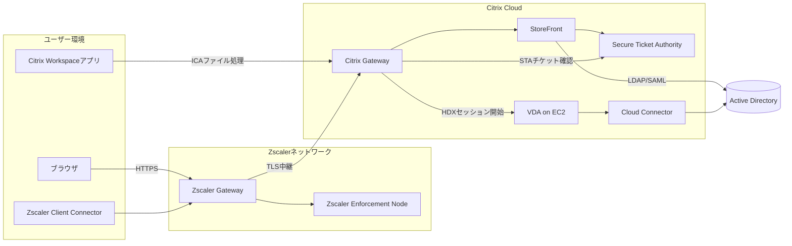
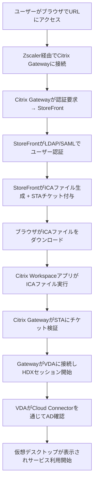
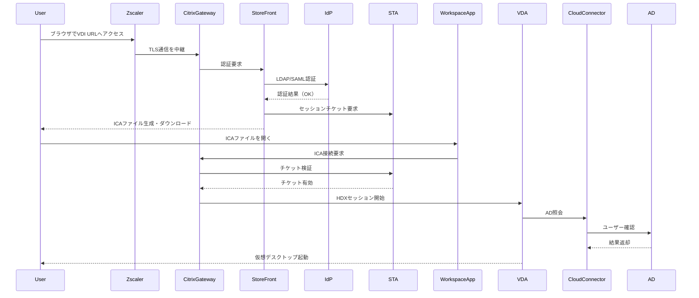

# Citrix

もちろんです、崇史さん。Citrix Cloud環境での**マシンカタログの更新**と**Delivery Groupの構成管理**について、運用面や自動化の観点も含めて詳しく解説します。

---

## 🔄 マシンカタログの更新

マシンカタログは、仮想マシン（VDI）やセッションホストの構成を定義する単位です。更新には以下のようなケースがあります：

### 🧱 更新対象の例
- マスターイメージの変更（OSアップデート、アプリ追加）
- VDA（Virtual Delivery Agent）のバージョン更新
- NICやネットワーク設定の変更
- コンピューターアカウントの再割り当て

### 🛠️ 更新手順（Studio使用）

1. **マスターイメージの準備**
   - 新しい仮想マシンを作成し、必要な更新を適用
   - スナップショットを取得（MCS使用時）

2. **Studioで更新実行**
   - 「マシンカタログ」→対象カタログを選択
   - 「更新」→「マスターイメージの変更」
   - 新しいスナップショットを選択し、更新を適用

3. **更新の反映**
   - 非永続マシンは次回起動時に新イメージが反映
   - 永続マシンは手動で再構成が必要

📘 詳細手順：[マシンカタログの管理 | Citrix DaaS](https://docs.citrix.com/ja-jp/citrix-daas/install-configure/delivery-groups-manage.html)

---

## 🧩 Delivery Groupの構成と管理

Delivery Groupは、ユーザーに対して**アプリケーションやデスクトップを配信する単位**です。マシンカタログとユーザーを紐づけて構成します。

### ⚙️ 構成項目

| 項目             | 説明                                 |
| ---------------- | ------------------------------------ |
| マシン割り当て   | マシンカタログからVDIを選択          |
| ユーザー割り当て | ADユーザーやグループを指定           |
| アプリケーション | 公開アプリケーションの追加           |
| デスクトップ     | フルデスクトップの公開設定           |
| StoreFront設定   | 接続先URLや表示名の設定              |
| App Protection   | キーロガー・スクリーンキャプチャ対策 |

### 🛠️ 管理操作（Studio）

- 「Delivery Group」→対象グループを選択
- 「編集」→構成変更（ユーザー、アプリ、StoreFrontなど）
- 「マシンの表示」→登録状態や割り当て確認
- 「フォルダー管理」→グループの整理

📘 詳細手順：[Delivery Groupの管理 | Citrix DaaS](https://docs.citrix.com/ja-jp/citrix-daas/install-configure/delivery-groups-manage.html)

---

## 🧪 運用ベストプラクティス

- **マスターイメージ更新は業務時間外に実施**
- **Delivery Groupは用途別に分割（部門、アプリ別）**
- **PowerShell SDKで構成の自動化が可能**
- **App ProtectionやSecureICAでセキュリティ強化**

---

もし、PowerShellによるマシンカタログ更新やDelivery Groupの自動構成にも興味があれば、スクリプト例も紹介できます。あるいは、構成図やMermaidでの可視化もできますよ。どちらに進めましょうか？

以下に、Citrix Cloudでのマシンカタログ登録に関する権限と確認方法を整理しました。崇史さんのAWS EC2環境とCitrix Cloud構成に合わせて、実務的な視点で解説します。

---

### 🛠 既存マシンカタログへの新規マシン登録に必要な権限

Citrix Studio（Web StudioまたはWindows Studio）でマシンカタログを操作するには、以下の権限が必要です：

- **マシンカタログ管理権限**
  - マシンの追加・削除・編集
  - Active Directoryアカウントの管理
  - マスターイメージの変更

- **ドメイン管理権限（AD）**
  - 新規マシンのADアカウント作成または既存アカウントの参照
  - ドメイン資格情報の入力が必要な場合あり

- **Studioアクセス権限**
  - Citrix Cloud管理者としてStudioにログインできる必要があります

> これらは「フルアクセス管理者」または「カスタムアクセス管理者（マシンカタログ操作が許可されたロール）」に割り当てられている必要があります。

---

### 🔐 Citrix Cloudの主要な権限ロール

Citrix Cloudでは、管理者に以下のようなロールベースの権限を割り当てます：

| ロール名                   | 説明                                                               |
| -------------------------- | ------------------------------------------------------------------ |
| **フルアクセス管理者**     | すべてのサービスと機能にアクセス可能                               |
| **カスタムアクセス管理者** | 指定されたサービス・機能のみ操作可能（例：Studio、マシンカタログ） |
| **読み取り専用管理者**     | 表示のみ可能、編集不可                                             |

> カスタムアクセス管理者には、Studioやマシンカタログの操作権限を個別に付与できます。

---

### 🔍 ログインユーザーの権限を確認する方法

Citrix Cloudにログイン後、以下の手順で自身または他ユーザーの権限を確認できます：

1. Citrix Cloudにログイン（https://citrix.cloud.com）
2. 左上メニューから「**IDおよびアクセス管理**」を選択
3. 「**管理者**」タブを開く
4. 自分のメールアドレスを探し、右端の「…」メニューから「**アクセスの編集**」を選択
5. 割り当てられているロールと権限が表示されます

> 「カスタムアクセス」が設定されている場合は、Studioやマシンカタログの操作権限があるかどうかを個別に確認できます。

---

### ✅ 登録権限があるかどうかの実務的チェックポイント

- Studioにログインできるか？
- 「マシンカタログ」ノードが表示されているか？
- 「マシンの追加」ボタンが有効か？
- ADアカウントの作成または参照ができるか？

これらがすべて可能であれば、既存カタログへのマシン追加権限があると判断できます。

---

必要であれば、PowerShellでの権限確認やロール追加手順もご案内できます。Citrix Cloud ConnectorやAD連携の構成状況にもよるので、もう少し環境情報をいただければ、より具体的にサポートできますよ。

次に、Studioでのマシン追加手順を整理してみましょうか？それとも、カスタムロールの作成方法に進みますか？

もちろんです、崇史さん。Citrix Cloudや仮想デスクトップ環境の運用に関わる重要な用語や概念を、以下に体系的にまとめました。ご自身のCitrix Cloud ConnectorやWindows Server環境の設計・運用にも役立つはずです。

---

## 🧩 基本用語と概念の解説

### 🏪 StoreFront
- **役割**：ユーザーがアプリケーションやデスクトップにアクセスするための**ポータル機能**を提供
- **特徴**：
  - Citrix Gatewayと連携して**外部アクセス**を可能にする
  - **ユーザー認証**や**リソースの列挙**を行う
  - Citrix WorkspaceアプリやWebブラウザからアクセス可能

### 🌐 NetScaler / Citrix Gateway
- **役割**：セキュアなリモートアクセスを提供する**リバースプロキシ兼VPNゲートウェイ**
- **主な機能**：
  - **ICAプロキシ**：HDXセッションの中継
  - **認証**：LDAP、RADIUS、SAMLなどに対応
  - **SmartAccess / SmartControl**：ポリシーベースのアクセス制御
- **構成例**：
  - StoreFrontと統合し、**シングルサインオン（SSO）**を実現

---

## 🧑‍💻 セッションタイプの違い

| セッションタイプ       | 特徴                                | 利用シーン                                     |
| ---------------------- | ----------------------------------- | ---------------------------------------------- |
| **シングルセッション** | 1ユーザーが1台の仮想マシンを専有    | 高セキュリティ、個別カスタマイズが必要な業務   |
| **マルチセッション**   | 複数ユーザーが1台の仮想マシンを共有 | コスト効率重視、汎用業務（例：コールセンター） |

- **マルチセッションの注意点**：
  - アプリケーションの互換性確認が必要
  - ユーザー間のリソース競合に注意

---

## 🛠️ イメージ管理方式

| 方式                                 | 概要                                    | メリット               | デメリット                             |
| ------------------------------------ | --------------------------------------- | ---------------------- | -------------------------------------- |
| **MCS（Machine Creation Services）** | マスターイメージから差分ディスクを作成  | 管理が簡単、更新が高速 | ストレージ依存、スケーラビリティに制限 |
| **PVS（Provisioning Services）**     | vDiskをネットワーク経由でストリーミング | 高速起動、IOPS削減     | ネットワーク依存、構成が複雑           |
| **手動（フルクローン）**             | 1台ずつ仮想マシンを構築                 | 柔軟性が高い           | 運用負荷が高く、更新に時間がかかる     |

---

## 🧱 マスターイメージとは？
- **定義**：仮想マシンのテンプレート。OS、アプリ、設定を含む
- **用途**：
  - MCSやPVSで仮想デスクトップを展開する際のベース
  - 更新やロールバックの基点となる
- **Citrix Cloudでの管理**：
  - **Image Management機能**により、事前に準備済みイメージを作成し、複数カタログで再利用可能
  - PowerShellやStudioから操作可能

---

## 🧠 Citrix Cloud運用に役立つその他の概念

### 🔐 Secure Ticket Authority（STA）
- HDXセッションの認証に使用される**セッションチケット発行機関**
- Citrix GatewayとStoreFront間のセキュアな通信に必須

### 🧩 Hosting Unit / Resource Pool
- 仮想化環境（Azure, VMwareなど）とCitrix Cloudを接続する**論理単位**
- イメージ管理やマシンカタログの展開先を定義

### 🧪 Canary Rollout
- 新しいマスターイメージを**一部ユーザーに先行展開**して検証する手法
- 本番環境への影響を最小限に抑える

### 📦 Machine Catalog
- 仮想マシンのグループ。ユーザーに割り当てる単位
- シングル/マルチセッション、永続/非永続などの設定を含む

---

## 🚀 次のステップ

崇史さんのようにCitrix Cloud ConnectorやWindows Server環境を設計・運用されている方にとって、これらの概念は**自動化・可視化・復旧性の向上**に直結します。もし、Citrix CloudとAWS Systems Managerの連携や、マスターイメージの更新フローを**Mermaidで図式化**したい場合もお手伝いできますよ。

気になる項目を深掘りしていきましょうか？それとも、実際の構成例やベストプラクティスを見てみますか？

崇史さんのCitrix Cloud環境にぴったりな内容ですね。以下に、**STA・HDX・ICAプロキシ**、**認証プロトコル（LDAP/RADIUS/SAML）とSmartAccess/SmartControl**、**ポータル機能・リバースプロキシ・VPNゲートウェイ**について、技術的かつ実務的に詳しく解説します。

---

## 🎟 Secure Ticket Authority（STA）

STAは、**Citrix GatewayとVDA間のHDXセッションを認証・保護するためのチケット発行機関**です。

### 🔐 役割と仕組み

- StoreFrontがユーザー認証後、STAに**セッションチケット**を要求
- Citrix Gatewayは、ICA接続時にSTAにチケットを照会し、**正当性を検証**
- チケットは**一度限り有効**で、使用後は即時破棄される

### 🧱 構成ポイント

- STAは通常、**Cloud Connector**または**Delivery Controller**上で動作
- Citrix GatewayとStoreFrontの**STA構成が一致**している必要あり
- 複数STAを構成する場合、**負荷分散は非推奨**（セッション整合性のため）

---

## 🖥 HDXとICAプロキシ

### 🧭 HDX（High Definition Experience）

- Citrix独自の**リモート表示プロトコル**
- RDPよりも**帯域効率が高く、マルチメディア最適化**に優れる
- 音声、USB、印刷、グラフィックなどを**仮想化環境で快適に操作**

### 🔄 ICAプロキシ

- Citrix Gatewayが**外部からのICAトラフィックを中継**
- ICAセッションは**STAチケットで認証**され、VDAに接続
- **HTTPS（443）ポート**で暗号化された通信を処理

---

## 🔐 認証プロトコルとSmartAccess / SmartControl

### 🧬 LDAP（Lightweight Directory Access Protocol）

- **Active Directoryとの連携**に使用
- Citrix GatewayやStoreFrontが**ユーザー情報を照会・認証**

### 📡 RADIUS（Remote Authentication Dial-In User Service）

- **VPNやWi-Fi認証**に使われるプロトコル
- Citrix Gatewayで**二要素認証（OTPなど）**に活用可能

### 🛡 SAML（Security Assertion Markup Language）

- **SSO（シングルサインオン）**を実現
- Azure ADやOktaなどの**IdP（Identity Provider）**と連携

### 🧠 SmartAccess / SmartControl

| 機能         | SmartAccess                        | SmartControl              |
| ------------ | ---------------------------------- | ------------------------- |
| ポリシー適用 | ユーザー属性やデバイス状態に応じて | Gateway側でセッション制御 |
| 要件         | StoreFront + Gateway + STA         | Gateway単体でも可能       |
| 例           | BYOD端末には印刷禁止               | 特定ユーザーにUSB制限     |

---

## 🏪 ポータル機能・リバースプロキシ・VPNゲートウェイ

### 🖼 ポータル機能（StoreFront）

- **ユーザーがアプリやデスクトップにアクセスするUI**
- WebブラウザまたはCitrix Workspaceアプリから利用
- **SSO、リソース列挙、セッション再接続**などを提供

### 🔁 リバースプロキシ（Citrix Gateway）

- 外部からのアクセスを**内部リソースに中継**
- ICAプロキシ、SSL VPN、SmartAccessなどを統合
- **セキュアな通信経路（TLS）**を確保

### 🌐 VPNゲートウェイ（Citrix Gateway）

- **SSL VPN機能**を提供（フルトンネル、クライアントレス）
- **認証・暗号化・アクセス制御**を一元管理
- Citrix Gatewayは**VPN + リバースプロキシ + 認証統合**の役割を担う

---

もし、これらの構成を**Mermaidで図式化**したり、**PowerShellで自動化**したい場合もお手伝いできますよ。どの項目をさらに深掘りしましょうか？🧠💡

…Citrix Workspaceアプリが起動し、HDXセッションが確立されます。以下に、Citrix Cloud環境でのこの一連の処理を**ネットワーク構成と技術要素の観点**から整理してみましょう。

---

## 🌐 Citrix Cloudにおける接続処理の流れ

### 1. 🔐 ユーザー認証（ブラウザアクセス）

- ユーザーはブラウザで **StoreFront または Citrix Gateway** にアクセス
- 認証方式に応じて、以下が使用されます：
  - **LDAP**：Active Directoryベースの認証
  - **RADIUS**：OTPや多要素認証
  - **SAML**：Azure ADやOktaとのSSO連携

### 2. 📄 ICAファイルの生成とダウンロード

- 認証後、StoreFrontは **ICAファイル（*.ica）** を生成
- ICAファイルには以下の情報が含まれます：
  - VDAのIPアドレスまたはFQDN
  - セッションパラメータ（画面サイズ、リダイレクト設定など）
  - STAチケット（Secure Ticket Authorityによるセッション認証）

> ICAファイルは一時的なセッション定義ファイルで、Citrix Workspaceアプリがこれを読み込んで接続を開始します。

### 3. 🚀 ICAファイルの実行とHDXセッションの確立

- ユーザーがICAファイルを開くと、**Citrix Workspaceアプリ**が起動
- ICAプロキシ（Citrix Gateway）が**STAチケットを検証**
- VDA（Virtual Delivery Agent）に接続し、**HDXセッション**が開始

---

## 🧠 技術要素の補足

| 要素                               | 説明                                                    |
| ---------------------------------- | ------------------------------------------------------- |
| **STA（Secure Ticket Authority）** | ICA接続の正当性を検証するチケット発行機関               |
| **ICAプロキシ**                    | Citrix GatewayがICAトラフィックを中継                   |
| **HDX**                            | Citrix独自の高性能リモート表示プロトコル                |
| **Citrix Workspaceアプリ**         | ICAファイルを読み込み、セッションを開始するクライアント |

---

## 🛠 よくあるトラブルと対処

- ICAファイルが開かない場合：
  - 既定アプリが **Citrix Connection Manager** に設定されているか確認
  - `wfcrun32.exe` が正しく関連付けられているかチェック

- 「安全にダウンロードできません」と表示される場合：
  - ブラウザのセキュリティ設定を確認（Edge/Chromeの例あり）

---

この流れをMermaidで図式化することもできますし、Citrix GatewayのSmartAccessポリシーで制御する方法も掘り下げられます。次は、セッション確立後のリソース制御やログの取得について見てみましょうか？🧠📊

もちろんです崇史さん。**Citrix Cloud × Zscaler環境におけるログインからHDXセッション開始までの全体処理**を、技術要素ごとに整理したうえで、以下の3つのMermaid図に分けて詳細に記述します：

- 🧭 ネットワーク構成図（Citrix CloudとZscalerを含む全体トポロジー）
- 🔄 処理フロー図（ユーザー操作とサービス間連携の流れ）
- 🎬 シーケンス図（主要コンポーネント間の通信順序）

---

## 🧭 ネットワーク構成図（Mermaid：graph LR）

---

## 🔄 処理フロー図（Mermaid：flowchart TD）

---

## 🎬 シーケンス図（Mermaid：sequenceDiagram）

---

これらの図は、Citrix Cloud + Zscalerを用いたエンタープライズ環境のセッション初期化処理を網羅しています。さらに細かい要素（SmartAccessポリシー処理、SSL VPN適用前後のネットワーク境界）も追加できます。

次に、**この構成のログ取得ポイント**や、**接続遅延の分析手法（RTT, packet loss）**を整理してみましょうか？それとも、このMermaid図を**Markdownドキュメント化して展開可能な運用手引き**として仕上げてもいいですね。どう進めましょう？📊🧠📘

はい、Citrixで構築されたVDIサービスをAWSに**リプレイスすることは技術的に可能**です。CitrixはAWS環境に対応しており、Citrix DaaS（旧Citrix Virtual Apps and Desktops）を使って、AWS上で仮想デスクトップやアプリケーションを提供できます。

ただし、リプレイスにはいくつかの**難所や設計上の考慮点**があります。以下に詳しく整理します。

---

## ✅ CitrixサービスをAWSにリプレイスする方法

- Citrix Cloudを利用して、**セッションブローカーや管理コンポーネントをクラウド化**
- AWS EC2上にVDA（Virtual Delivery Agent）を展開
- StoreFrontやCitrix GatewayをAWS上に構築、またはCitrix Gateway Serviceを利用
- MCS（Machine Creation Services）を使ってAMIからマシンカタログを構築

---

## ⚠ リプレイス時に難しいと感じるポイント

### 1. 🧱 ネットワーク設計の複雑さ
- AWSではGARP（Gratuitous ARP）が使えないため、NetScalerのHA構成が制限される
- 代替として、**ルートテーブルの書き換え**や**ロードバランサー構成**が必要

### 2. 🔐 セキュリティと認証の再設計
- Active Directory連携やSAML/RADIUS認証の再構成
- DHCPオプションセットやDNSのカスタマイズが必要

### 3. 🧠 マスターイメージとプロビジョニングの移行
- オンプレのマスターイメージをAWS用AMIに変換する必要あり
- PVSはAzureでは対応が進んでいるが、AWSでは制限がある場合も

### 4. 📦 IAMとAPIキー管理
- Citrix StudioでAWS接続を作成する際、**IAMユーザーのAPIキーとシークレットキー**が必要
- AWS IAMの形式に合わせた資格情報ファイルが必要

### 5. 📊 コストと運用負荷の変化
- AWSの従量課金モデルに合わせた**電源管理やスケーリング戦略**が必要
- Citrix CloudとAWSの両方の監視・ログ収集が必要になる

---

## 🧠 補足：リプレイスを成功させるためのヒント

| 項目               | 推奨アプローチ                              |
| ------------------ | ------------------------------------------- |
| ネットワーク冗長性 | AWS LB + 複数NetScaler構成                  |
| セキュリティ       | IAMロール + Security Hub + GuardDuty        |
| 自動化             | Terraform + Systems Manager + Lambda        |
| モニタリング       | CloudWatch + Citrix Director連携            |
| コスト最適化       | スケジュール電源管理 + SPOTインスタンス活用 |

---

Citrix CloudとAWSの連携は非常に柔軟ですが、**オンプレミスの構成と同じ感覚で移行しようとすると設計の壁にぶつかる**ことがあります。崇史さんのようにAWSの自動化やCitrix Cloud Connectorに精通されている方なら、**段階的な移行やハイブリッド構成**も視野に入れて設計できるはずです。

次は、**MermaidでAWS上のCitrix構成図**を描いてみましょうか？それとも、**リプレイス時のチェックリスト**を整理してみましょうか？🧠📘

Citrix公式ドキュメントで、**Citrix Cloud × Zscaler環境におけるログインからHDXセッション開始までの処理を図で説明している箇所**は、以下のような構成図やシーケンス図が含まれるページで確認できます。Zscalerとの統合に関する図は、Citrix SD-WANやGatewayサービスとの連携を中心に記載されています。

---

## 🧭 Citrix公式ドキュメントで関連図が掲載されているページ一覧

### 1. [Citrix SD-WANとZscalerの統合構成図](https://docs.netscaler.com/ja-jp/citrix-sd-wan-center/current-release/zscaler-integration.html)
- **内容**：Citrix SD-WANとZscaler Enforcement Node（ZEN）間のIPsecトンネル構成図
- **図の種類**：
  - ネットワーク構成図（SD-WAN → Zscaler）
  - ZENとの接続フロー
  - Zscaler API連携のワークフロー図

---

### 2. [Citrix Cloud製品ドキュメントポータル](https://docs.citrix.com/ja-jp/)
- **内容**：Citrix Cloud、Gateway、HDX、StoreFront、VDAなどの構成図が含まれる各製品ページ
- **図の種類**：
  - Citrix GatewayとStoreFrontの接続図
  - HDXセッションの処理フロー
  - WorkspaceアプリとVDA間の通信図

> 各製品（Citrix Gateway、Citrix DaaS、Citrix Workspaceなど）のページにアクセスし、「アーキテクチャ」や「通信フロー」セクションを探すと、公式の構成図が掲載されています。

---

### 3. [Zscaler通信フローとポリシー適用のシーケンス図](https://ithy.com/article/zscaler-traffic-policy-sequence-i9gwsati)
- **内容**：Zscaler Client Connector（ZCC）→ ZIA → ZPA → App Connectorの通信処理シーケンス
- **図の種類**：
  - シーケンス図（ZCCからApp Connectorまで）
  - ポリシー評価順序図
  - マインドマップ形式の処理フロー

> Citrix GatewayやHDXセッションとは直接関係しませんが、Zscaler側の通信処理を理解する上で非常に参考になります。

---

### 4. [Citrix Tech Zone（英語）](https://techzone.citrix.com/)
- **内容**：Citrix Cloudとサードパーティ製品（Zscaler含む）との統合事例や構成図
- **図の種類**：
  - リファレンスアーキテクチャ
  - シーケンス図（Citrix Workspace → Gateway → VDA）

> Tech Zoneでは、実際の導入事例に基づいた図解が豊富です。Zscalerとの統合構成も一部掲載されています。

---

必要であれば、これらの図をもとに**Mermaidで再構成したカスタム図**も作成できますよ。どの図をベースに深掘りしてみましょうか？📘🧠📡

