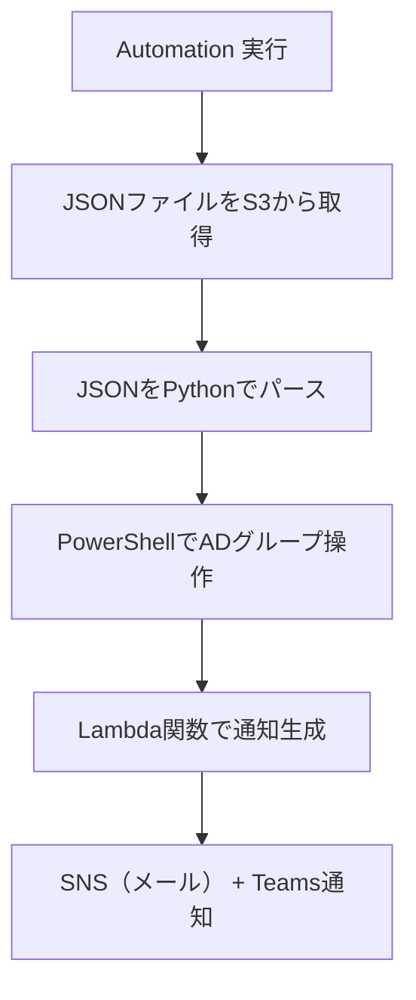

# 🧑‍💼 Active Directory グループメンバー管理 自動化タスク構成資料  
（ユーザー追加操作を JSON 指定で自動化）

---

## 📌 タスク概要

| 項目     | 内容                                                                |
| -------- | ------------------------------------------------------------------- |
| タスク名 | ManageADGroupMembershipFromJson                                     |
| 対象     | Active Directory ドメイン `testdomain.com` 上のグループ `testgroup` |
| 実行内容 | ユーザー `testuser` をグループに追加                                |
| 実行方法 | AWS Systems Manager Automation による任意実行                       |
| 入力形式 | JSONファイル（S3 URIで指定）                                        |
| 通知     | 実行完了後に Microsoft Teams とメール（SNS）に結果を送信            |

---

## 🎯 要件整理

### ✅ 機能要件

- JSONファイルに以下の情報を含める：
  - `domain`: Active Directory ドメイン名（例：`testdomain.com`）
  - `group`: グループ名（例：`testgroup`）
  - `user`: ユーザー名（例：`testuser`）
  - `action`: 操作種別（`add` または `remove`）
- Automation ドキュメントが JSON を読み取り、PowerShell で AD 操作を実行
- 成否を通知に含める

### ✅ 非機能要件

- 実行はマネジメントコンソール上で完結
- 対象インスタンスは AD ドメインに参加済みで、RSATツールがインストールされていること
- 通知はメール（SNS）と Microsoft Teams に送信
- JSONファイルは S3 に安全に格納されていること

---

## 🧾 JSON ファイル（例）

```json
{
  "domain": "testdomain.com",
  "group": "testgroup",
  "user": "testuser",
  "action": "add"
}
```

---

## 📐 JSON スキーマ定義（厳格）

```json
{
  "$schema": "http://json-schema.org/draft-07/schema#",
  "title": "AD Group Membership Task",
  "type": "object",
  "required": ["domain", "group", "user", "action"],
  "properties": {
    "domain": {
      "type": "string",
      "pattern": "^[a-zA-Z0-9.-]+$"
    },
    "group": {
      "type": "string",
      "minLength": 1
    },
    "user": {
      "type": "string",
      "minLength": 1
    },
    "action": {
      "type": "string",
      "enum": ["add", "remove"]
    }
  },
  "additionalProperties": false
}
```

---

## 🧩 処理フロー図（Mermaid）



---

## ⚙️ Automation ドキュメント構成（要約）

| ステップ名    | 処理内容                                                               |
| ------------- | ---------------------------------------------------------------------- |
| downloadJson  | S3 から JSON ファイルをダウンロードし、内容を取得                      |
| parseJson     | JSON を Python でパースし、各フィールドを抽出                          |
| manageGroup   | PowerShell で `Add-ADGroupMember` または `Remove-ADGroupMember` を実行 |
| notifyResults | Lambda 関数で SNS + Teams に通知を送信                                 |

---

## 📬 通知例（Teams / メール）

```
✅ SSM Automation タスク完了: ManageADGroupMembershipFromJson
📊 実行結果:
Domain: testdomain.com
Group: testgroup
User: testuser
Action: add
Status: Success
```

---

## 🔐 セキュリティと運用のベストプラクティス

| 項目       | 推奨設定                                                            |
| ---------- | ------------------------------------------------------------------- |
| S3バケット | パブリックアクセスブロック、有効なバージョニング、暗号化（SSE-KMS） |
| IAM制御    | Automation 実行ロールのみに `s3:GetObject` を許可                   |
| JSON検証   | CI/CDで jsonschema による検証を実施                                 |
| ログ監査   | CloudTrail + S3アクセスログでアップロード履歴を監査                 |
| 通知       | Lambda 関数で SNS + Teams に送信、実行結果を明示                    |

---

## ✅ まとめ

| 項目         | 内容                                                  |
| ------------ | ----------------------------------------------------- |
| ドメイン     | testdomain.com                                        |
| グループ     | testgroup                                             |
| ユーザー     | testuser                                              |
| アクション   | add                                                   |
| 実行形式     | JSONファイルを S3 に格納し、Automation で読み取り実行 |
| 通知         | Lambda 経由で SNS + Teams に送信                      |
| セキュリティ | IAM制御、スキーマ検証、S3暗号化、監査ログ             |
