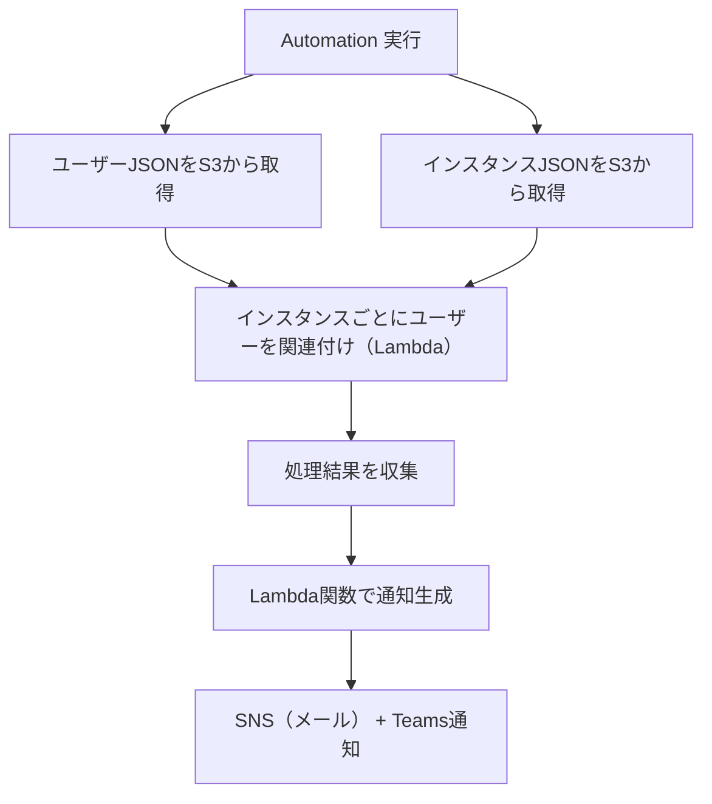

# 🧾 Office Professional Plus インスタンス関連付け 自動化タスク構成資料

---

## 📌 タスク概要

| 項目     | 内容                                                                |
| -------- | ------------------------------------------------------------------- |
| タスク名 | AssociateOfficeUsers                                                |
| 実行形式 | 任意のタイミングで1回実行（Systems Manager Automation）             |
| 入力形式 | S3 に格納されたユーザー情報 JSON + インスタンス情報 JSON            |
| 対象     | Office Professional Plus がインストールされた EC2 インスタンス      |
| 実行内容 | 各インスタンスに対して複数ユーザーを関連付け（License Manager API） |
| 通知     | 実行完了後に Lambda 経由で SNS + Microsoft Teams に通知             |

---

## 📂 入力ファイル（S3）

### ✅ ユーザー情報 JSON（users.json）

```json
[
  {
    "username": "testuser01",
    "directory_id": "sd-12345678",
    "domain": "test-self-domain"
  },
  {
    "username": "testuser02",
    "directory_id": "sd-12345678",
    "domain": "test-self-domain"
  }
]
```

### ✅ インスタンス情報 JSON（instances.json）

```json
{
  "instanceIds": [
    "i-0123abcd",
    "i-0456efgh"
  ]
}
```

---

## 🎯 要件整理

### ✅ 機能要件

- S3 に格納されたユーザー情報とインスタンス情報を取得
- 各インスタンスに対して全ユーザーを関連付け（associate-user）
- 各処理の成功/失敗を記録し、まとめて通知

### ✅ 非機能要件

- Automation ドキュメントは「インスタンス → ユーザー」の順でループ処理
- associate-user の処理は Lambda 関数に外出し
- 通知は Lambda 経由で SNS + Teams に送信
- JSON スキーマ検証により入力ファイルの整合性を担保

---

## 🧩 処理フロー図（Mermaid）



---

## ⚙️ Automation ドキュメント構成（YAML）

```yaml
description: "Office Professional Plus インスタンス関連付け処理（Lambda + 通知）"
schemaVersion: '0.3'
assumeRole: "{{ AutomationAssumeRole }}"
parameters:
  UsersJsonS3Uri:
    type: String
  InstancesJsonS3Uri:
    type: String
  AssociateLambdaArn:
    type: String
  SnsTopicArn:
    type: String
mainSteps:
  - name: downloadUsers
    action: aws:downloadContent
    inputs:
      SourceType: S3
      SourceInfo: '{"path": "{{ UsersJsonS3Uri }}" }'
    outputs:
      - Name: users
        Selector: "$.Content"
        Type: StringMapList

  - name: downloadInstances
    action: aws:downloadContent
    inputs:
      SourceType: S3
      SourceInfo: '{"path": "{{ InstancesJsonS3Uri }}" }'
    outputs:
      - Name: instanceIds
        Selector: "$.Content.instanceIds"
        Type: StringList

  - name: associateLoop
    action: aws:foreach
    inputs:
      Iterator: "{{ downloadInstances.instanceIds }}"
      Steps:
        - name: associateUsersToInstance
          action: aws:invokeLambdaFunction
          inputs:
            FunctionName: "{{ AssociateLambdaArn }}"
            Payload:
              instance_id: "{{ item }}"
              users: "{{ downloadUsers.users }}"

  - name: notifyCompletion
    action: aws:invokeLambdaFunction
    inputs:
      FunctionName: "SendSSMNotificationWithResults"
      Payload:
        title: "Office Professional Plus のユーザー関連付け"
        results: "{{ associateLoop.associateUsersToInstance.Payload.results }}"
        snsTopicArn: "{{ SnsTopicArn }}"
```

---

## 🧠 Lambda関数：associate-users-to-instance

```python
import boto3

def lambda_handler(event, context):
    lm = boto3.client('license-manager-user-subscriptions')
    instance_id = event['instance_id']
    users = event['users']
    results = []

    for user in users:
        try:
            lm.associate_user(
                Username=user['username'],
                InstanceId=instance_id,
                IdentityProvider={
                    'ActiveDirectoryIdentityProvider': {
                        'DirectoryId': user['directory_id']
                    }
                },
                Domain=user['domain']
            )
            results.append(f"🖥️ {instance_id} ← 👤 {user['username']}: Success")
        except Exception as e:
            results.append(f"🖥️ {instance_id} ← 👤 {user['username']}: Failed - {str(e)}")

    return { "results": results }
```

---

## ✅ 通知例（Teams / メール）

```
✅ SSM Automation タスク完了: Office Professional Plus のユーザー関連付け
📊 実行結果:
🖥️ i-0123abcd ← 👤 testuser01: Success  
🖥️ i-0123abcd ← 👤 testuser02: Failed - AccessDeniedException  
🖥️ i-0456efgh ← 👤 testuser01: Success  
🖥️ i-0456efgh ← 👤 testuser02: Success  
```

---

## 🧪 JSON スキーマ検証による品質担保

### ✅ users.schema.json

```json
{
  "type": "array",
  "items": {
    "type": "object",
    "required": ["username", "directory_id", "domain"],
    "properties": {
      "username": { "type": "string" },
      "directory_id": { "type": "string", "pattern": "^sd-[a-z0-9]{8}$" },
      "domain": { "type": "string", "format": "hostname" }
    }
  }
}
```

### ✅ instances.schema.json

```json
{
  "type": "object",
  "required": ["instanceIds"],
  "properties": {
    "instanceIds": {
      "type": "array",
      "items": { "type": "string", "pattern": "^i-[a-z0-9]{8,}$" }
    }
  }
}
```

### ✅ 検証方法（CI/CD）

```bash
jsonschema -i users.json users.schema.json
jsonschema -i instances.json instances.schema.json
```

---

## 🔐 セキュリティと運用のベストプラクティス

| 項目       | 推奨設定                                                                            |
| ---------- | ----------------------------------------------------------------------------------- |
| IAM制御    | Automation 実行ロールに `lambda:InvokeFunction`、`s3:GetObject` を許可              |
| Lambda IAM | associate-users Lambda に `license-manager-user-subscriptions:AssociateUser` を許可 |
| S3バケット | SSE-KMS 暗号化、有効なバージョニング、パブリックアクセスブロック                    |
| JSON検証   | スキーマに基づく CI/CD 検証で品質担保                                               |

---

## 🚀 今後の拡張案

- disassociate-user による関連解除処理の自動化
- stop-product-subscription によるライセンス解放処理の追加
- 実行結果の CloudWatch Logs 連携と可視化
- スケジュール実行やイベントトリガーによる自動化強化
