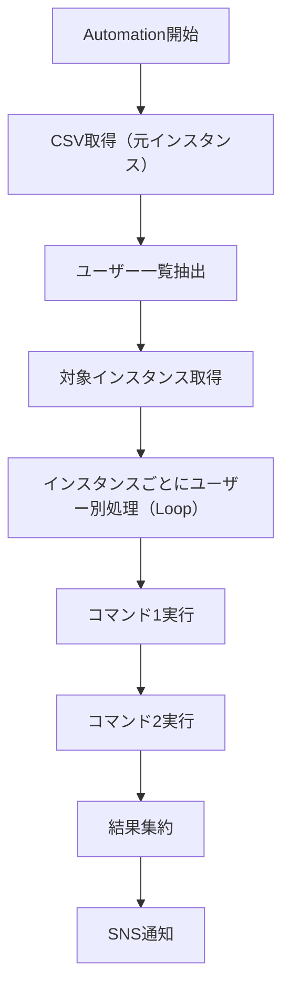
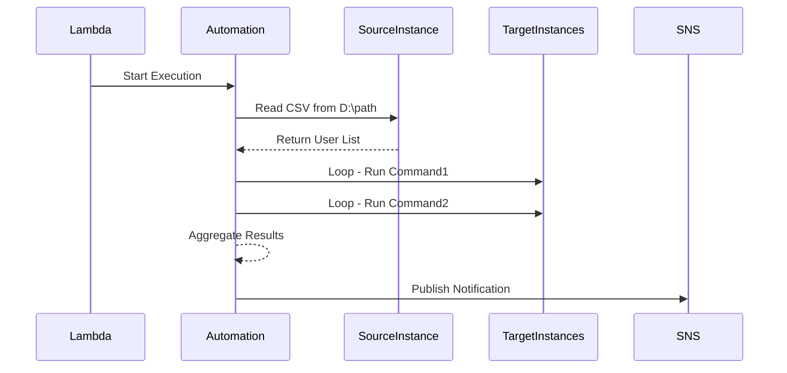

# 📄 Officeライセンス管理業務 自動化 要件定義書

## 🎯 目的

AWS Systems Manager Automationを使用して、Microsoft Officeライセンスの以下2つの管理業務を自動化する：

- **ユーザー追加処理**
- **ユーザー削除処理**

この自動化により、業務の標準化・運用負荷軽減・処理精度向上を図る。

---

## 🧩 対象業務の内容

| 業務内容             | 詳細                                                                                    |
| -------------------- | --------------------------------------------------------------------------------------- |
| ユーザー一覧取得     | 指定のEC2インスタンスのDドライブに格納されたCSVファイルを参照し、ユーザー一覧を取得する |
| 対象インスタンス抽出 | タグやCSVなどで管理されている対象インスタンス一覧を抽出する                             |
| コマンド同期実行     | 各インスタンスに対し、全ユーザーに対して2つのOfficeライセンス関連コマンドを順次実行する |
| 処理結果通知         | 実行結果をSNSを介して通知する（成功／失敗／レスポンス等）                               |

---

## 🚀 Automationドキュメントの起動方法（エントリーポイント）

| 方法                          | 説明                                                          |
| ----------------------------- | ------------------------------------------------------------- |
| AWSマネジメントコンソール     | 手動で実行、パラメータ確認後実行可能。テストにも活用可        |
| AWS CLI（.batファイル経由）   | Windows端末などでバッチファイルを実行し、自動化処理をトリガー |
| Systems Managerスケジューラー | 指定時間に定期実行することで、業務の時間制御を実現            |

---

## 🏗️ 処理構成（共通）

- Automationドキュメント（Runbook）は YAML形式
- パラメータとして以下を指定：
  - `UserListSourceInstanceId`：CSV格納元のインスタンスID
  - `UserListPath`：Dドライブ上のCSVファイルパス
  - `TargetInstanceList`：対象インスタンスID（タグ抽出または外部入力）
- 各ユーザーへのコマンド実行は `aws:loop` と `aws:runCommand` で制御

---

## 📊 処理フロー図（共通）

---

## 🕒 シーケンス図（Officeライセンス ユーザー追加）

---

## 🧠 補足事項

- コマンドの実行順序は同期的に制御（Run Commandステップを順次記述）
- 実行ログは CloudWatch Logs に保管（トレース性と監査対応）
- IAMロールは Automationが各サービスにアクセスできるように設計（必要な最小権限）
