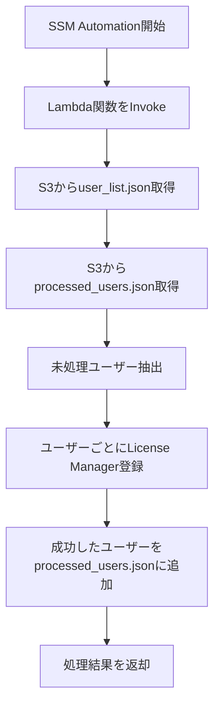

# 🧠 License Manager 自動登録処理（S3状態管理版）

## 📌 概要

この構成は、AWS Systems Manager Automation を起点に、Lambda 関数を呼び出して License Manager の `start-product-subscription` をユーザーごとに実行するものです。ユーザーリストは S3 に保存されており、Lambda は処理済みユーザーを S3 に記録することで、**途中で中断されても再実行可能な設計**になっています。

---

## 🧩 処理フロー（Mermaid）



---

## 🧾 SSM Document（YAML）

```yaml
schemaVersion: '2.2'
description: "Trigger Lambda to register users via License Manager"
parameters:
  LambdaFunctionName:
    type: String
    description: "Name of the Lambda function to invoke"
  S3Bucket:
    type: String
    description: "S3 bucket containing user list and state"
  UserListKey:
    type: String
    description: "S3 key for user_list.json"
  StateKey:
    type: String
    description: "S3 key for processed_users.json"
mainSteps:
  - name: InvokeLambda
    action: aws:invokeLambdaFunction
    inputs:
      FunctionName: "{{ LambdaFunctionName }}"
      Payload: |
        {
          "bucket": "{{ S3Bucket }}",
          "user_key": "{{ UserListKey }}",
          "state_key": "{{ StateKey }}"
        }
```

---

## 🧠 Lambda関数（Python）

```python
import boto3
import json

def lambda_handler(event, context):
    bucket = event['bucket']
    user_key = event['user_key']
    state_key = event['state_key']

    s3 = boto3.client('s3')
    lm = boto3.client('license-manager-user-subscriptions')

    # ユーザーリスト取得
    user_obj = s3.get_object(Bucket=bucket, Key=user_key)
    user_data = json.loads(user_obj['Body'].read().decode('utf-8'))
    all_users = user_data['Users']
    directory_id = user_data['DirectoryId']
    domain = user_data['Domain']
    product = user_data['Product']

    # 処理済みユーザー取得（なければ空）
    try:
        state_obj = s3.get_object(Bucket=bucket, Key=state_key)
        processed = json.loads(state_obj['Body'].read().decode('utf-8'))['Processed']
    except s3.exceptions.NoSuchKey:
        processed = []

    remaining = [u for u in all_users if u not in processed]
    results = []
    newly_processed = []

    for user in remaining:
        try:
            lm.start_product_subscription(
                username=user,
                product=product,
                identityProvider={
                    'ActiveDirectoryIdentityProvider': {
                        'DirectoryId': directory_id
                    }
                },
                domain=domain
            )
            results.append(f"{user}　成功")
            newly_processed.append(user)

            # 状態を即時更新
            updated_state = {'Processed': processed + newly_processed}
            s3.put_object(
                Bucket=bucket,
                Key=state_key,
                Body=json.dumps(updated_state).encode('utf-8')
            )
        except Exception as e:
            results.append(f"{user}　失敗　{str(e)}")

    return {
        'status': 'completed',
        'results': results,
        'remaining': len(remaining) - len(newly_processed)
    }
```

---

## 📂 S3ファイル例

### `user_list.json`

```json
{
  "Users": ["user01", "user02", "user03"],
  "DirectoryId": "d-xxxxxxxxxx",
  "Domain": "corp.example.local",
  "Product": "MicrosoftOffice"
}
```

### `processed_users.json`

```json
{
  "Processed": ["user01"]
}
```

---

## 🔐 IAMロールとポリシー

### Lambda実行ロール（例）

```json
{
  "Version": "2012-10-17",
  "Statement": [
    {
      "Effect": "Allow",
      "Action": [
        "s3:GetObject",
        "s3:PutObject",
        "license-manager-user-subscriptions:StartProductSubscription"
      ],
      "Resource": [
        "arn:aws:s3:::your-bucket-name/*"
      ]
    }
  ]
}
```

### SSM Automation 実行ロール（例）

```json
{
  "Version": "2012-10-17",
  "Statement": [
    {
      "Effect": "Allow",
      "Action": [
        "lambda:InvokeFunction"
      ],
      "Resource": "arn:aws:lambda:ap-northeast-1:123456789012:function:YourLambdaFunction"
    }
  ]
}
```

---

## 💡 設計の意図と工夫

- **Lambdaのタイムアウト対策**：処理済みユーザーを都度S3に記録することで、途中で中断されても再実行可能
- **冪等性の確保**：同じユーザーに対して重複実行されないよう、状態管理で制御
- **シンプルな構成**：DynamoDBを使わず、S3のみで完結することで導入障壁を下げる
- **拡張性**：将来的に `associate-user` や SNS通知、CloudWatch Logs への統合も容易

---

## ✅ 次のステップ（オプション）

- SNS通知で処理結果を報告
- CloudWatch Logsへの出力
- DynamoDBベースへの移行
- `associate-user` コマンドとの統合
