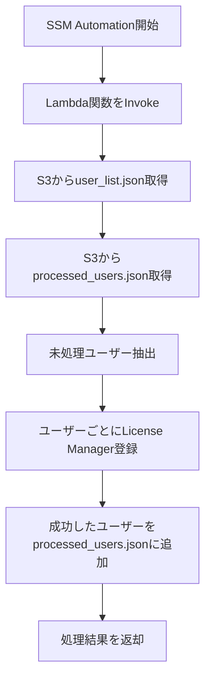

# 🧠 License Manager 自動登録処理（S3状態管理版）

## 📌 概要

この構成は、AWS Systems Manager Automation を起点に、Lambda 関数を呼び出して License Manager の `start-product-subscription` をユーザーごとに実行するものです。ユーザーリストは S3 に保存されており、Lambda は処理済みユーザーを S3 に記録することで、**途中で中断されても再実行可能な設計**になっています。

---

## 🧩 処理フロー（Mermaid）



---

## 🧾 SSM Document（YAML）

```yaml
schemaVersion: '2.2'
description: "Trigger Lambda to register users via License Manager"
parameters:
  LambdaFunctionName:
    type: String
    description: "Name of the Lambda function to invoke"
  S3Bucket:
    type: String
    description: "S3 bucket containing user list and state"
  UserListKey:
    type: String
    description: "S3 key for user_list.json"
  StateKey:
    type: String
    description: "S3 key for processed_users.json"
mainSteps:
  - name: InvokeLambda
    action: aws:invokeLambdaFunction
    inputs:
      FunctionName: "{{ LambdaFunctionName }}"
      Payload: |
        {
          "bucket": "{{ S3Bucket }}",
          "user_key": "{{ UserListKey }}",
          "state_key": "{{ StateKey }}"
        }
```

---

## 📂 S3ファイル例

### `user_list.json`

```json
{
  "Users": ["user01", "user02", "user03"],
  "DirectoryId": "d-xxxxxxxxxx",
  "Domain": "corp.example.local",
  "Product": "MicrosoftOffice"
}
```

### `processed_users.json`

```json
{
  "Processed": ["user01"]
}
```

---

## 🔐 IAMロールとポリシー

### Lambda実行ロール（例）

```json
{
  "Version": "2012-10-17",
  "Statement": [
    {
      "Effect": "Allow",
      "Action": [
        "s3:GetObject",
        "s3:PutObject",
        "license-manager-user-subscriptions:StartProductSubscription"
      ],
      "Resource": [
        "arn:aws:s3:::your-bucket-name/*"
      ]
    }
  ]
}
```

### SSM Automation 実行ロール（例）

```json
{
  "Version": "2012-10-17",
  "Statement": [
    {
      "Effect": "Allow",
      "Action": [
        "lambda:InvokeFunction"
      ],
      "Resource": "arn:aws:lambda:ap-northeast-1:123456789012:function:YourLambdaFunction"
    }
  ]
}
```

---

## 🔧 修正後 Lambda関数（S3状態管理なし・冪等性は License Manager の状態のみで判断）

```python
import boto3
import json

def lambda_handler(event, context):
    bucket = event['bucket']
    user_key = event['user_key']

    s3 = boto3.client('s3')
    lm = boto3.client('license-manager-user-subscriptions')

    # ユーザーリスト取得
    user_obj = s3.get_object(Bucket=bucket, Key=user_key)
    user_data = json.loads(user_obj['Body'].read().decode('utf-8'))
    all_users = user_data['Users']
    directory_id = user_data['DirectoryId']
    domain = user_data['Domain']
    product = user_data['Product']

    # サブスクリプション済みユーザーを取得して除外
    try:
        subscriptions = lm.list_product_subscriptions(
            IdentityProvider={
                'ActiveDirectoryIdentityProvider': {
                    'DirectoryId': directory_id
                }
            },
            Product='OFFICE_PROFESSIONAL_PLUS'
        )
        already_subscribed_users = [
            sub['Username'] for sub in subscriptions.get('ProductUserSummaries', [])
            if sub.get('Status') == 'SUBSCRIBED'
        ]
        remaining = [u for u in all_users if u not in already_subscribed_users]
    except Exception as e:
        print(f"list_product_subscriptions エラー: {str(e)}")
        remaining = all_users

    results = []

    for user in remaining:
        try:
            lm.start_product_subscription(
                username=user,
                product=product,
                identityProvider={
                    'ActiveDirectoryIdentityProvider': {
                        'DirectoryId': directory_id
                    }
                },
                domain=domain
            )
            results.append(f"{user}　成功")
        except Exception as e:
            results.append(f"{user}　失敗　{str(e)}")

    return {
        'status': 'completed',
        'results': results,
        'executed_users': len(remaining)
    }
```

---

## 🔄 修正ポイントまとめ

| 項目                     | 修正内容                                                               |
| ------------------------ | ---------------------------------------------------------------------- |
| ✅ 処理済みユーザーの取得 | 完全に削除し、S3 から `processed_users.json` は読まない                |
| ✅ 状態更新               | 都度 `put_object` せず、更新処理を廃止                                 |
| ✅ 冪等性確保             | License Manager の `list_product_subscriptions` の状態を基準に除外制御 |
| ✅ 結果返却               | 成功／失敗のみ返却、状態は外部に保存しない                             |


---

**可読性・テスト性・拡張性を高める工夫**を紹介します。

---

## 🔁 環境変数 & SSM Parameter Store 対応版 Lambda 関数

```python
import boto3
import os
import json

def lambda_handler(event, context):
    # SSM からプロダクト名を取得
    ssm = boto3.client('ssm')
    param_name = os.getenv('PRODUCT_PARAM_NAME', '/LicenseManager/ProductName')
    try:
        product = ssm.get_parameter(Name=param_name)['Parameter']['Value']
    except Exception as e:
        print(f"SSM Parameter取得失敗: {str(e)}")
        return {'status': 'error', 'message': 'プロダクト取得失敗'}

    bucket = event['bucket']
    user_key = event['user_key']

    s3 = boto3.client('s3')
    lm = boto3.client('license-manager-user-subscriptions')

    # ユーザー情報取得
    user_obj = s3.get_object(Bucket=bucket, Key=user_key)
    user_data = json.loads(user_obj['Body'].read().decode('utf-8'))
    all_users = user_data['Users']
    directory_id = user_data['DirectoryId']
    domain = user_data['Domain']

    # 既存のサブスクユーザー取得
    try:
        subscriptions = lm.list_product_subscriptions(
            IdentityProvider={
                'ActiveDirectoryIdentityProvider': {
                    'DirectoryId': directory_id
                }
            },
            Product=product
        )
        already_subscribed = [
            u['Username'] for u in subscriptions.get('ProductUserSummaries', [])
            if u.get('Status') == 'SUBSCRIBED'
        ]
        targets = [u for u in all_users if u not in already_subscribed]
    except Exception as e:
        print(f"list_product_subscriptions エラー: {str(e)}")
        targets = all_users

    results = []

    for user in targets:
        try:
            lm.start_product_subscription(
                username=user,
                product=product,
                identityProvider={
                    'ActiveDirectoryIdentityProvider': {
                        'DirectoryId': directory_id
                    }
                },
                domain=domain
            )
            results.append(f"{user} 成功")
        except Exception as e:
            results.append(f"{user} 失敗 {str(e)}")

    return {
        'status': 'completed',
        'results': results,
        'executed_users': len(targets)
    }
```

---

## 🧩 改善ポイント

| 観点       | 工夫内容                                                           |
| ---------- | ------------------------------------------------------------------ |
| ✅ 柔軟性   | PRODUCT 名を環境変数 & SSM で取得可能にし、複数製品展開への布石    |
| ✅ 拡張性   | `PRODUCT_PARAM_NAME` をデフォルト化し、Lambda 再利用性向上         |
| ✅ テスト性 | SSM取得失敗時の早期エラー返却により、テストケースが明確に分岐      |
| ✅ 可読性   | 構造を明瞭に分離（SSM取得 → S3取得 → API処理）し、デバッグしやすい |

---

さらに踏み込むなら、以下も検討できます：

- 🪝 **SNS通知連携**：処理ログを SNS 経由で管理者に通知
- 📊 **CloudWatch Logs 整備**：userごとの処理ステータス記録用に構造化ログ設計
- 🧪 **ユニットテスト用ハンドラ分割**：関数を小分けにして pytest などで検証可能に
