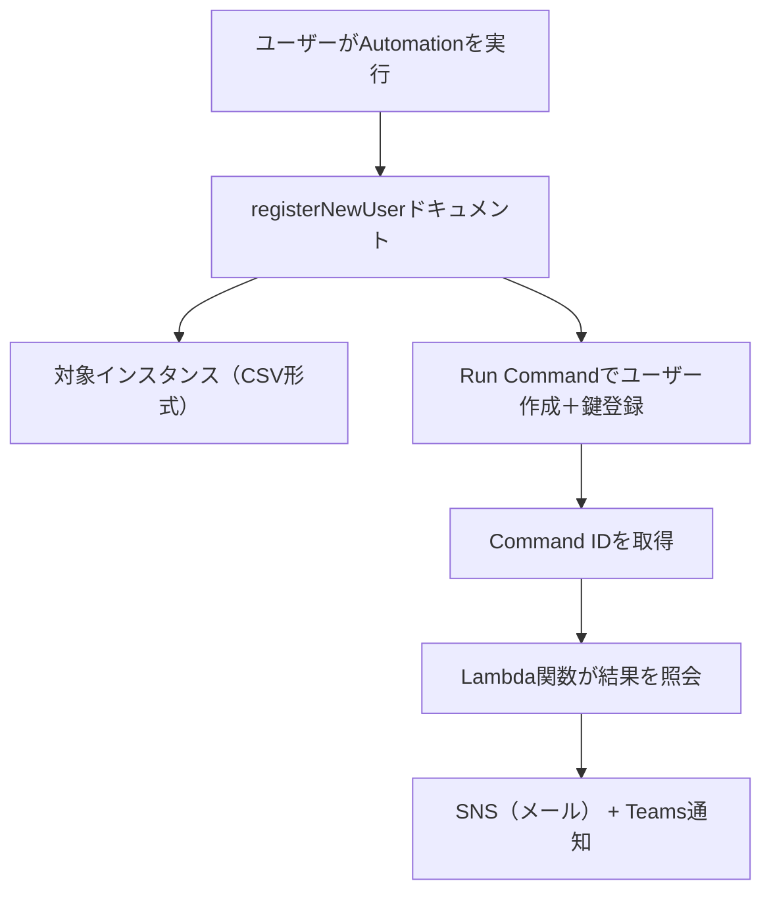

# 👤 registerNewUser タスク構成資料（複数インスタンス + 成否通知付き）

---

## 📌 タスク概要

| 項目     | 内容                                                          |
| -------- | ------------------------------------------------------------- |
| タスク名 | registerNewUser                                               |
| 対象     | 複数の Amazon Linux 2023 インスタンス                         |
| 実行内容 | 新規ユーザー作成＋公開鍵登録                                  |
| 実行方法 | Systems Manager Automation（1回限りの任意実行）               |
| 通知     | 実行完了後に Microsoft Teams とメール（SNS）に成功/失敗を通知 |
| 通知内容 | 各インスタンスごとの成功/失敗ステータスを含む                 |

---

## 🎯 要件整理

### ✅ 機能要件

- 任意のユーザー名とSSH公開鍵を指定
- 複数インスタンスに同時実行（CSV形式で指定）
- 実行結果（成功/失敗）と対象インスタンス一覧を通知

### ✅ 非機能要件

- 実行はマネジメントコンソール上で完結
- SSH不要（SSM Agent経由）
- 通知はメールとTeams両方に送信
- 通知には各インスタンスのステータスを含む

---

## 🧩 構成図（Mermaid）



---

## 🧠 Automation ドキュメント解説

### 📄 ドキュメント全体（YAML）

```yaml
schemaVersion: '0.3'
description: "Create user and register SSH key on multiple AL2023 instances with detailed notification"
parameters:
  username:
    type: String
    description: "New user to create"
  sshPublicKey:
    type: String
    description: "SSH public key to add"
  instanceCsv:
    type: String
    description: "Comma-separated list of instance IDs"
  snsTopicArn:
    type: String
    description: "SNS topic ARN for notification"
mainSteps:
  - name: parseInstanceIds
    action: aws:executeScript
    inputs:
      Runtime: python3.8
      Handler: handler
      Script: |
        def handler(events, context):
            return events['instanceCsv'].split(',')
      InputPayload:
        instanceCsv: "{{ instanceCsv }}"

  - name: createUserAndAddKey
    action: aws:runCommand
    outputs:
      - Name: CommandId
        Selector: $.Command.CommandId
        Type: String
    inputs:
      DocumentName: AWS-RunShellScript
      InstanceIds: "{{ parseInstanceIds.Output }}"
      Parameters:
        commands:
          - |
            set -e
            sudo useradd -m -s /bin/bash {{ username }} || echo "User already exists"
            sudo mkdir -p /home/{{ username }}/.ssh
            echo "{{ sshPublicKey }}" | sudo tee /home/{{ username }}/.ssh/authorized_keys
            sudo chown -R {{ username }}:{{ username }} /home/{{ username }}/.ssh
            sudo chmod 700 /home/{{ username }}/.ssh
            sudo chmod 600 /home/{{ username }}/.ssh/authorized_keys

  - name: notifyCompletion
    action: aws:invokeLambdaFunction
    inputs:
      FunctionName: "SendSSMNotificationWithResults"
      Payload:
        username: "{{ username }}"
        instanceCsv: "{{ instanceCsv }}"
        snsTopicArn: "{{ snsTopicArn }}"
        commandId: "{{ createUserAndAddKey.CommandId }}"
```

### 🔍 ステップごとの解説

| ステップ名          | 説明                                                                      |
| ------------------- | ------------------------------------------------------------------------- |
| parseInstanceIds    | 入力されたCSV文字列をPythonで分割し、インスタンスIDのリストに変換         |
| createUserAndAddKey | Run Commandで各インスタンスに対してユーザー作成と公開鍵登録を実行         |
| notifyCompletion    | Lambda関数を呼び出し、Command ID を使って各インスタンスの結果を取得し通知 |

---

## 📬 Lambda関数：SendSSMNotificationWithResults

```python
import json
import boto3
import os
import urllib3

def lambda_handler(event, context):
    ssm = boto3.client('ssm')
    sns = boto3.client('sns')
    http = urllib3.PoolManager()

    username = event['username']
    instance_ids = event['instanceCsv'].split(',')
    command_id = event['commandId']
    topic_arn = event['snsTopicArn']
    webhook_url = os.environ.get('TEAMS_WEBHOOK_URL')

    results = []
    for instance_id in instance_ids:
        try:
            output = ssm.get_command_invocation(
                CommandId=command_id,
                InstanceId=instance_id
            )
            status = output['Status']
            results.append(f"🖥️ {instance_id}: {status}")
        except Exception as e:
            results.append(f"🖥️ {instance_id}: ERROR - {str(e)}")

    message = f"""
✅ SSM Automation タスク完了: registerNewUser
👤 ユーザー名: {username}
📊 実行結果:
{chr(10).join(results)}
"""

    if topic_arn:
        sns.publish(TopicArn=topic_arn, Message=message, Subject='SSM Automation Notification')

    if webhook_url:
        http.request('POST', webhook_url,
                     body=json.dumps({"text": message}),
                     headers={'Content-Type': 'application/json'})

    return {"status": "Notification sent"}
```

---

## 📬 通知例（Teams / メール）

```
✅ SSM Automation タスク完了: registerNewUser
👤 ユーザー名: deploy
📊 実行結果:
🖥️ i-0123abcd: Success
🖥️ i-0456efgh: Failed
🖥️ i-0789ijkl: Success
```

---

## 🧪 実行手順（マネジメントコンソール）

1. Systems Manager → Automation → Execute automation
2. ドキュメント：`registerNewUser`
3. パラメータ入力：
   - `username`：例）`deploy`
   - `sshPublicKey`：例）`ssh-rsa AAAAB3Nza...`
   - `instanceCsv`：例）`i-0123abcd,i-0456efgh`
   - `snsTopicArn`：SNSトピックのARN（例：`arn:aws:sns:ap-northeast-1:123456789012:ssm-notify-topic`）

---

## ✅ まとめ

| 機能                   | 対応内容                                  |
| ---------------------- | ----------------------------------------- |
| 複数インスタンス指定   | CSV形式で指定し、Pythonで分解             |
| ユーザー作成＋鍵登録   | Run Commandで一括実行                     |
| 通知（メール + Teams） | Lambda経由でSNSとWebhookに送信            |
| 通知内容               | 各インスタンスの成功/失敗ステータスを含む |
| 実行形式               | 任意のタイミングで1回実行（Automation）   |
