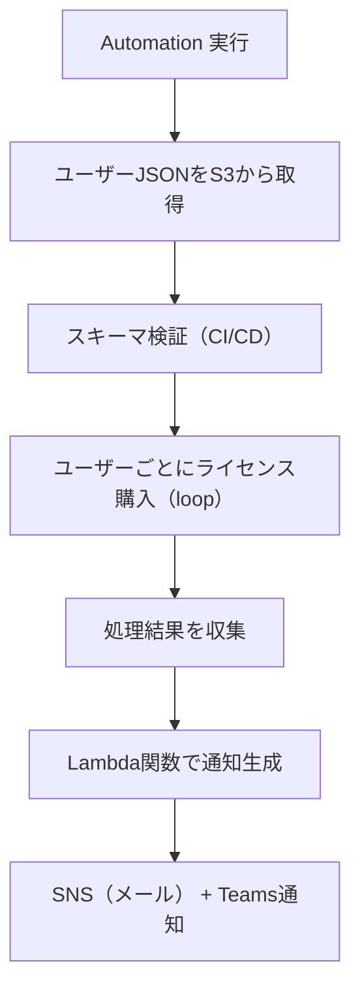

# 🧾 Office Professional Plus ライセンス購入 自動化タスク構成資料（完成版）

## 📌 タスク概要

| 項目     | 内容                                                               |
| -------- | ------------------------------------------------------------------ |
| タスク名 | ManageSPLALicensing                                                |
| 実行形式 | 任意のタイミングで1回実行（Systems Manager Automation）            |
| 入力形式 | S3 に格納されたユーザー情報 JSON                                   |
| 対象     | AWS License Manager User-based Subscription                        |
| 実行内容 | 各ユーザーに対して Office Professional Plus のライセンスを割り当て |
| 通知     | 実行完了後に Lambda 経由で SNS + Microsoft Teams に通知            |

---

## 📂 入力ファイル（S3）

```json
[
  {
    "username": "testuser01",
    "product": "OFFICE_PROFESSIONAL_PLUS",
    "directory_id": "sd-12345678",
    "domain": "test-self-domain"
  },
  {
    "username": "testuser02",
    "product": "OFFICE_PROFESSIONAL_PLUS",
    "directory_id": "sd-12345678",
    "domain": "test-self-domain"
  }
]
```

---

## 🎯 要件整理

### ✅ 機能要件

- S3 に格納された JSON からユーザー情報を取得
- 各ユーザーに対して License Manager の `start-product-subscription` を実行
- 各ユーザーの処理結果（成功/失敗）を記録
- 全ユーザーの結果をまとめて通知

### ✅ 非機能要件

- 実行はマネジメントコンソール上で完結
- Automation ドキュメントは loop を使用してユーザーを順次処理
- 通知は Lambda 経由で SNS + Teams に送信
- JSON スキーマ検証により入力ファイルの整合性を担保

---

## 🧩 処理フロー図（Mermaid）



---

## 🧪 JSON スキーマ検証による品質担保

### ✅ スキーマ定義（users.schema.json）

```json
{
  "$schema": "http://json-schema.org/draft-07/schema#",
  "type": "array",
  "items": {
    "type": "object",
    "required": ["username", "product", "directory_id", "domain"],
    "properties": {
      "username": { "type": "string" },
      "product": {
        "type": "string",
        "enum": ["OFFICE_PROFESSIONAL_PLUS"]
      },
      "directory_id": {
        "type": "string",
        "pattern": "^sd-[a-z0-9]{8}$"
      },
      "domain": { "type": "string", "format": "hostname" }
    }
  }
}
```

### ✅ 検証方法（CI/CD 例）

```bash
pip install jsonschema
jsonschema -i users.json users.schema.json
```

### ✅ 検証タイミング

| フェーズ           | 検証内容                                          |
| ------------------ | ------------------------------------------------- |
| 開発時             | スキーマに基づくローカル検証                      |
| CI/CD パイプライン | S3 アップロード前の自動検証                       |
| 本番実行前         | Automation ドキュメント内での軽量チェック（任意） |

---

## ⚙️ Automation ドキュメント、通知構成、Lambda 関数

（前述の YAML と Python Lambda 関数をそのまま使用）

---

## ✅ 通知例（Teams / メール）

```
✅ SSM Automation タスク完了: Office Professional Plus のライセンス購入
📊 実行結果:
👤 testuser01: Success
👤 testuser02: Failed - AccessDeniedException
```

---

## 🔐 セキュリティと運用のベストプラクティス

| 項目       | 推奨設定                                                                                                                              |
| ---------- | ------------------------------------------------------------------------------------------------------------------------------------- |
| IAM制御    | Automation 実行ロールに `license-manager-user-subscriptions:StartProductSubscription`、`s3:GetObject`、`lambda:InvokeFunction` を許可 |
| S3バケット | SSE-KMS 暗号化、有効なバージョニング、パブリックアクセスブロック                                                                      |
| CloudTrail | Automation 実行と License Manager API 呼び出しを監査対象に含める                                                                      |
| JSON検証   | スキーマに基づく CI/CD 検証で品質担保                                                                                                 |

---

## 🚀 今後の拡張案

- stop-product-subscription によるライセンス解放処理の自動化
- ユーザー登録・インスタンス関連付けステップの追加
- 実行結果の CloudWatch Logs 連携と可視化
- スケジュール実行やイベントトリガーによる自動化強化
