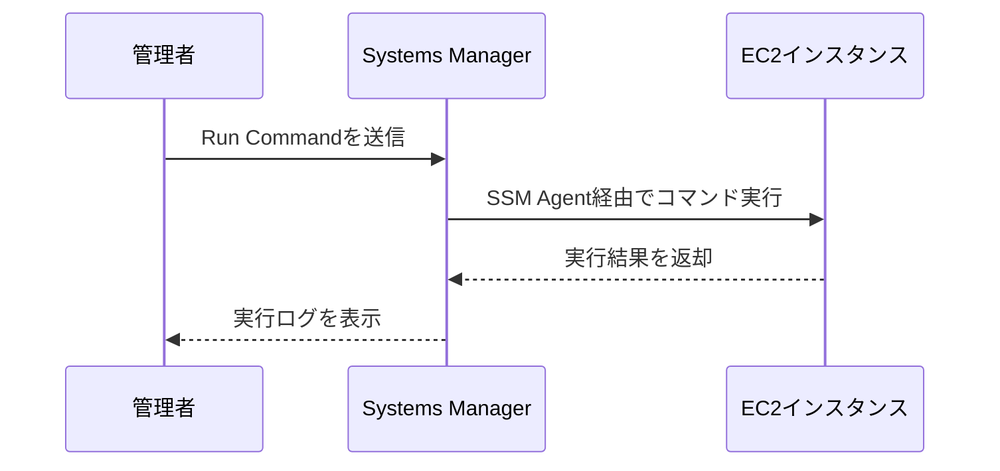
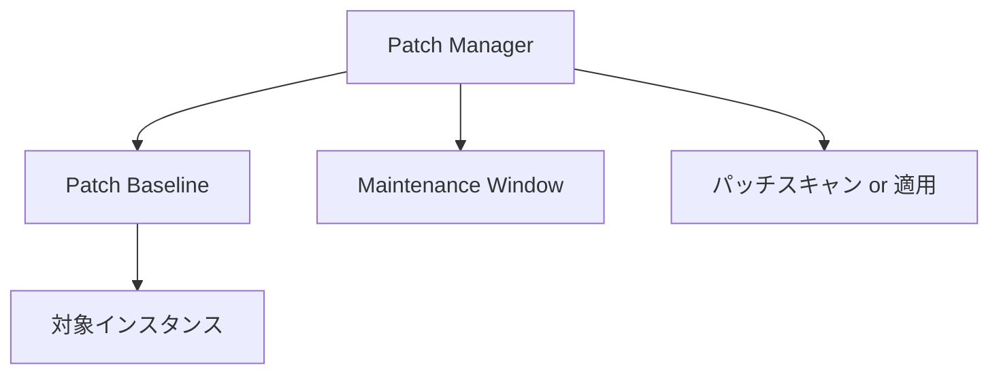
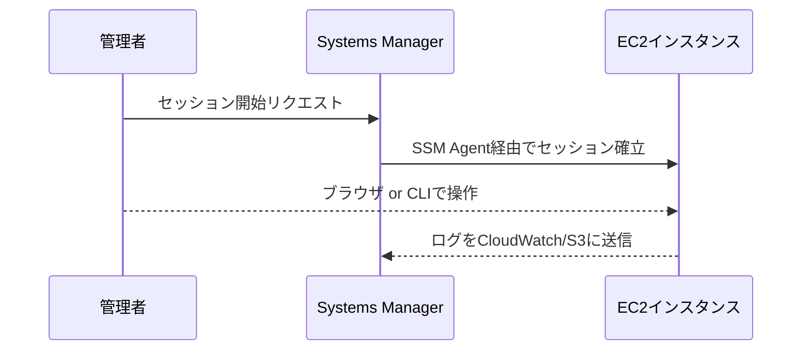
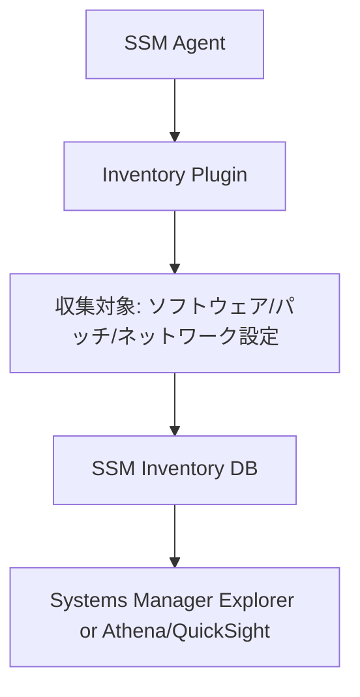
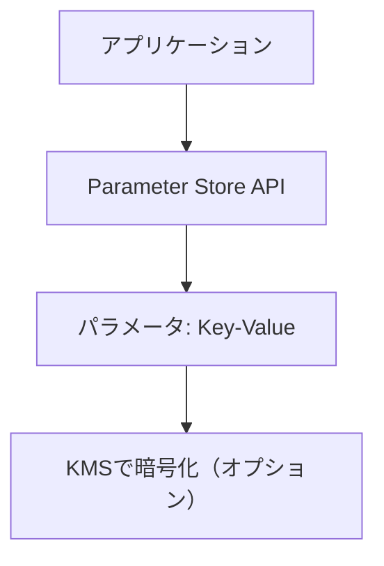
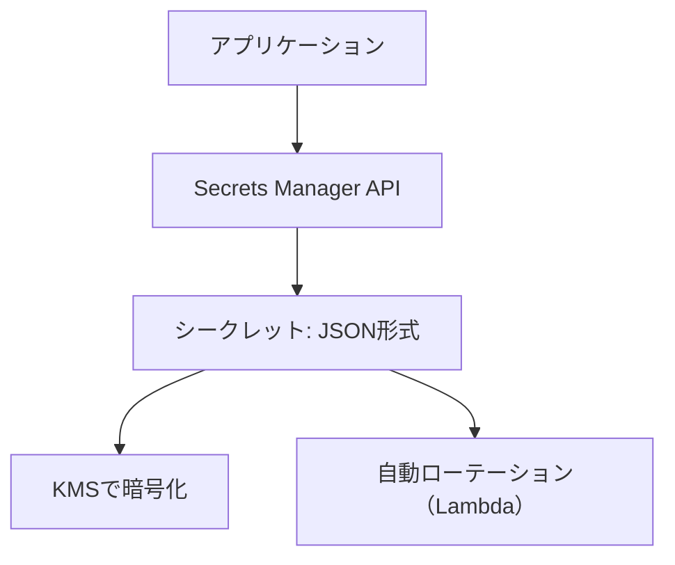
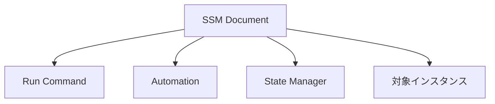
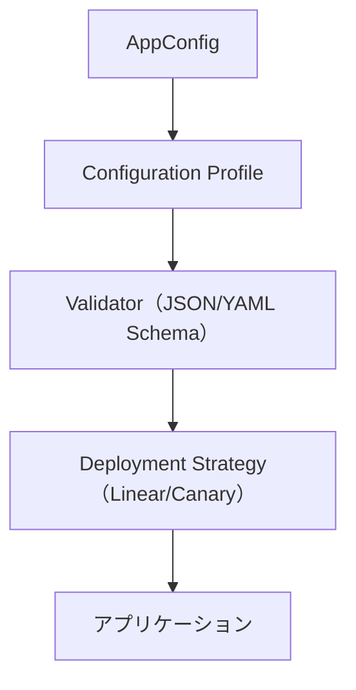
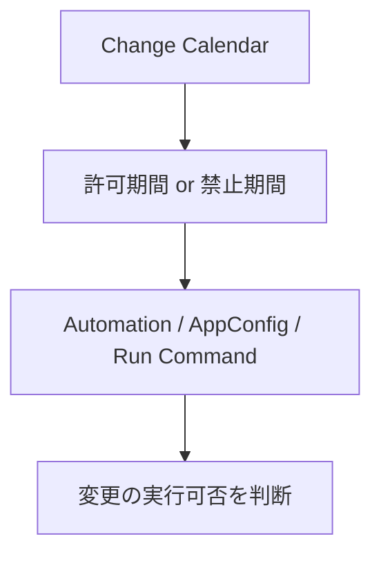

# 🛠️ AWS Systems Manager 概要資料

AWS Systems Manager（SSM）は、インフラストラクチャの運用と管理を自動化するためのサービス群です。EC2インスタンスやオンプレミスサーバーを対象に、構成管理、パッチ適用、リモートコマンド実行などを一元的に行えます。

---

## 📦 1. State Manager

State Managerは、インスタンスの状態（例：ソフトウェアのインストール、設定ファイルの整合性など）を自動的に維持するための機能です。

### ✅ 主な用途
- 定期的な構成適用（例：CloudWatch Agentのインストール）
- セキュリティポリシーの強制
- インスタンスの初期設定

### 🧩 構成イメージ

```mermaid
flowchart TD
    A[State Manager] --> B[SSM Document (Automation/Command)]
    B --> C[対象インスタンス群]
    A --> D[スケジュール or 起動時トリガー]
```

### 💡 補足
- SSM DocumentはJSON/YAML形式で定義
- タグやリソースグループで対象インスタンスを柔軟に指定可能

---

## 🖥️ 2. Run Command

Run Commandは、インスタンスに対してリモートでコマンドを実行できる機能です。SSH不要でセキュアに操作可能です。

### ✅ 主な用途
- パッケージのインストール
- ログの取得
- スクリプトの実行

### 🧩 構成イメージ



### 💡 補足
- IAMポリシーで操作権限を制御
- 実行ログはCloudWatch LogsやS3に保存可能

---

## 🛡️ 3. Patch Manager

Patch Managerは、OSやアプリケーションのパッチ適用を自動化する機能です。セキュリティリスクの低減に有効です。

### ✅ 主な用途
- Windows/Linuxのセキュリティパッチ適用
- 定期的なパッチスキャンとレポート生成
- メンテナンスウィンドウとの連携

### 🧩 構成イメージ



### 💡 補足
- Patch Baselineで適用対象のパッチを制御
- カスタムベースラインの作成も可能
- 適用結果はSystems Manager ExplorerやCloudWatchで可視化

---

## 🔐 共通ポイント

- すべての機能はSSM Agentがインストールされたインスタンスで動作
- IAMロール（例：AmazonSSMManagedInstanceCore）が必要
- ハイブリッド環境（オンプレミス）にも対応

---

## 🧠 まとめ

| 機能名        | 主な用途               | 実行タイミング         | 対象指定方法          |
| ------------- | ---------------------- | ---------------------- | --------------------- |
| State Manager | 構成の維持・自動適用   | 起動時 or 定期         | タグ/リソースグループ |
| Run Command   | リモートコマンド実行   | 手動実行               | タグ/インスタンスID   |
| Patch Manager | パッチのスキャンと適用 | メンテナンスウィンドウ | タグ/リソースグループ |

---

# 🔧 AWS Systems Manager 追加機能資料  
## 対象機能：Session Manager / Automation / Inventory

---

## 🖥️ 4. Session Manager

Session Managerは、EC2インスタンスやオンプレミスサーバーに対して、SSHやRDPを使わずにセキュアなシェルアクセスを提供する機能です。

### ✅ 主な用途
- SSHポートを開けずに安全にアクセス
- アクセスログの記録（CloudTrail/CloudWatch）
- IAMベースのアクセス制御

### 🧩 構成イメージ



### 💡 補足
- SSHキー管理が不要
- CloudTrailで操作履歴を完全に監査可能
- MFAやIP制限と組み合わせてゼロトラスト構成も可能

---

## 🤖 5. Automation

Automationは、定型的な運用タスク（例：AMI作成、インスタンス再起動、タグ付けなど）を自動化するワークフロー機能です。

### ✅ 主な用途
- AMIの定期作成と削除
- インスタンスの再起動や停止
- カスタム運用フローの構築

### 🧩 構成イメージ

```mermaid
flowchart TD
    A[Automation Document (SSM Automation)] --> B[ステップ1: タスク実行]
    B --> C[ステップ2: 条件分岐 or 承認]
    C --> D[ステップ3: 通知 or 次のアクション]
    A --> E[トリガー: 手動 or イベント or スケジュール]
```

### 💡 補足
- ステップごとに条件分岐や承認フローを設定可能
- AWSサービス（Lambda, SNS, EC2など）と連携可能
- 再利用可能なテンプレート（AWS提供 or カスタム）

---

## 📋 6. Inventory

Inventoryは、インスタンスにインストールされているソフトウェアや構成情報を収集・可視化する機能です。

### ✅ 主な用途
- ソフトウェア資産管理
- セキュリティ監査（未承認ソフトの検出）
- 構成ドリフトの検出

### 🧩 構成イメージ



### 💡 補足
- 収集項目はカスタマイズ可能
- データはAthenaやQuickSightで分析可能
- Resource Data SyncでS3にエクスポート可能

---

## 🧠 機能比較まとめ（追加分）

| 機能名          | 主な用途                    | 特徴                       | 連携先                 |
| --------------- | --------------------------- | -------------------------- | ---------------------- |
| Session Manager | セキュアなシェルアクセス    | SSH不要、完全監査可能      | CloudTrail, CloudWatch |
| Automation      | 運用タスクの自動化          | ステップ実行、条件分岐対応 | Lambda, SNS, EC2など   |
| Inventory       | ソフトウェア/構成情報の収集 | 可視化・分析・監査に活用   | Athena, QuickSight, S3 |

---

## 🔚 まとめ

これで、AWS Systems Managerの主要6機能（State Manager / Run Command / Patch Manager / Session Manager / Automation / Inventory）を網羅しました。  
それぞれの機能は単体でも強力ですが、組み合わせることでより高度な運用自動化が可能になります。

---

# 🧩 AWS Systems Manager 補助機能まとめ  
## 対象機能：Parameter Store / Secrets Manager / SSM Document / AppConfig / Change Calendar

---

## 🔐 1. Parameter Store

Parameter Storeは、設定値やシークレットを安全に保存・取得できるキーバリューストアです。

### ✅ 主な用途
- 環境変数の管理（例：DBホスト名、APIキー）
- アプリケーション設定の一元管理
- 暗号化されたパラメータの安全な共有

### 🧩 構成イメージ



### 💡 補足
- パラメータタイプ：String / StringList / SecureString
- IAMでアクセス制御可能
- バージョニング対応

---

## 🕵️‍♂️ 2. Secrets Manager

Secrets Managerは、データベース認証情報やAPIキーなどのシークレットを安全に保存・ローテーションできるサービスです。

### ✅ 主な用途
- DBパスワードの安全な保存と自動ローテーション
- アプリケーションのシークレット管理
- クロスアカウントアクセスの安全な共有

### 🧩 構成イメージ



### 💡 補足
- 自動ローテーションはLambdaで実装
- CloudTrailでアクセス監査可能
- Parameter Storeとの違い：ローテーション機能と高いセキュリティ

---

## 📄 3. SSM Document

SSM Documentは、Systems Managerの各機能（Run Command, Automationなど）で使用する操作手順やスクリプトを定義するテンプレートです。

### ✅ 主な用途
- Run CommandやAutomationの実行内容を定義
- カスタム運用フローの標準化
- JSON/YAMLで記述可能

### 🧩 構成イメージ



### 💡 補足
- AWS提供のドキュメントとカスタム作成が可能
- バージョン管理と共有（パブリック/プライベート）対応
- ドキュメントタイプ：Command / Automation / Session / Policy など

---

## ⚙️ 4. AppConfig

AppConfigは、アプリケーション設定のデプロイを安全に管理・ロールアウトできる機能です。

### ✅ 主な用途
- フィーチャーフラグの管理
- 設定変更の段階的デプロイ（カナリアリリース）
- 設定ミスによる障害の防止

### 🧩 構成イメージ



### 💡 補足
- 設定はS3/SSM Parameter Store/Secrets Managerなどに保存可能
- デプロイ戦略により段階的に反映
- CloudWatch Alarmsで自動ロールバック可能

---

## 📅 5. Change Calendar

Change Calendarは、運用変更を許可・禁止する期間を定義するカレンダー機能です。

### ✅ 主な用途
- メンテナンス期間の制御
- 重要イベント期間中の変更禁止（例：年末商戦）
- AutomationやAppConfigと連携して変更をブロック

### 🧩 構成イメージ



### 💡 補足
- iCalendar形式で定義
- 複数のカレンダーを作成可能
- IAMで編集・参照権限を制御

---

## 🧠 機能比較まとめ（補助機能）

| 機能名          | 主な用途                  | 特徴                                  | 連携先                   |
| --------------- | ------------------------- | ------------------------------------- | ------------------------ |
| Parameter Store | 設定値の保存・取得        | 暗号化・バージョン管理対応            | AppConfig, Lambda, EC2   |
| Secrets Manager | シークレットの安全な管理  | 自動ローテーション、監査対応          | RDS, Lambda, ECSなど     |
| SSM Document    | 操作手順のテンプレート化  | JSON/YAMLで定義、再利用可能           | Run Command, Automation  |
| AppConfig       | 設定の安全なデプロイ      | カナリア/リニア展開、ロールバック対応 | Parameter Store, Secrets |
| Change Calendar | 変更の許可/禁止期間の定義 | iCal形式、Automation/AppConfigと連携  | CloudWatch, Automation   |

---

## 🔚 まとめ

これらの補助機能は、Systems Managerの中核機能（Run Command, Automationなど）を支える重要なコンポーネントです。  
特にAppConfigやChange Calendarは、運用の信頼性と安全性を高めるために非常に有効です。

====
