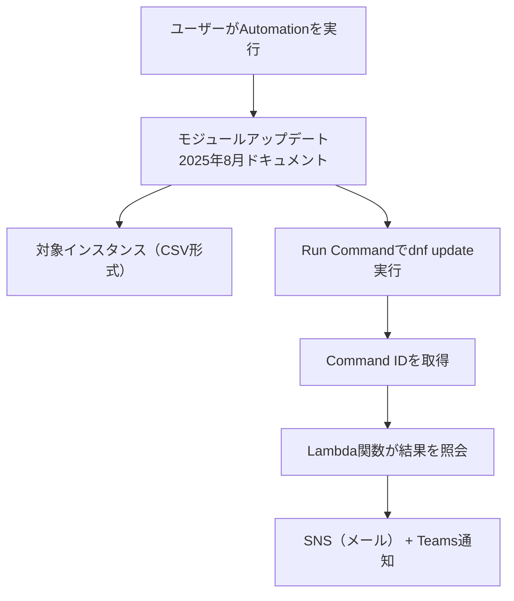

# 🔧 モジュールアップデート2025年8月 タスク構成資料  
（複数インスタンス + 成否通知付き）

---

## 📌 タスク概要

| 項目     | 内容                                                          |
| -------- | ------------------------------------------------------------- |
| タスク名 | モジュールアップデート2025年8月                               |
| 対象     | 複数の Amazon Linux 2023 インスタンス                         |
| 実行内容 | 指定パッケージの dnf update                                   |
| 実行方法 | Systems Manager Automation（1回限りの任意実行）               |
| 通知     | 実行完了後に Microsoft Teams とメール（SNS）に成功/失敗を通知 |
| 通知内容 | 各インスタンスごとの成功/失敗ステータスを含む                 |

---

## 🎯 要件整理

### ✅ 機能要件

- 任意のパッケージ名を指定して dnf update を実行
- 複数インスタンスに同時実行（CSV形式で指定）
- 実行結果（成功/失敗）と対象インスタンス一覧を通知

### ✅ 非機能要件

- 実行はマネジメントコンソール上で完結
- SSH不要（SSM Agent経由）
- 通知はメールとTeams両方に送信
- 通知には各インスタンスのステータスを含む

---

## 🧩 構成図（Mermaid）



---

## 📄 Automation ドキュメント（YAML）

```yaml
schemaVersion: '0.3'
description: "Update specified package on multiple AL2023 instances with detailed notification"
parameters:
  packageName:
    type: String
    description: "Package to update"
  instanceCsv:
    type: String
    description: "Comma-separated list of instance IDs"
  snsTopicArn:
    type: String
    description: "SNS topic ARN for notification"
mainSteps:
  - name: parseInstanceIds
    action: aws:executeScript
    inputs:
      Runtime: python3.8
      Handler: handler
      Script: |
        def handler(events, context):
            return events['instanceCsv'].split(',')
      InputPayload:
        instanceCsv: "{{ instanceCsv }}"

  - name: updatePackage
    action: aws:runCommand
    outputs:
      - Name: CommandId
        Selector: $.Command.CommandId
        Type: String
    inputs:
      DocumentName: AWS-RunShellScript
      InstanceIds: "{{ parseInstanceIds.Output }}"
      Parameters:
        commands:
          - |
            set -e
            echo "Updating package: {{ packageName }}"
            sudo dnf update -y {{ packageName }}

  - name: notifyCompletion
    action: aws:invokeLambdaFunction
    inputs:
      FunctionName: "SendSSMNotificationWithResults"
      Payload:
        taskName: "モジュールアップデート2025年8月"
        packageName: "{{ packageName }}"
        instanceCsv: "{{ instanceCsv }}"
        snsTopicArn: "{{ snsTopicArn }}"
        commandId: "{{ updatePackage.CommandId }}"
```

---

## 🧠 Lambda関数（SendSSMNotificationWithResults）

registerNewUser と同じ関数を再利用できますが、通知メッセージにパッケージ名とタスク名を含めるように拡張します：

```python
import json
import boto3
import os
import urllib3

def lambda_handler(event, context):
    ssm = boto3.client('ssm')
    sns = boto3.client('sns')
    http = urllib3.PoolManager()

    task_name = event.get('taskName', 'SSM Automation Task')
    package = event.get('packageName', 'N/A')
    instance_ids = event['instanceCsv'].split(',')
    command_id = event['commandId']
    topic_arn = event['snsTopicArn']
    webhook_url = os.environ.get('TEAMS_WEBHOOK_URL')

    results = []
    for instance_id in instance_ids:
        try:
            output = ssm.get_command_invocation(
                CommandId=command_id,
                InstanceId=instance_id
            )
            status = output['Status']
            results.append(f"🖥️ {instance_id}: {status}")
        except Exception as e:
            results.append(f"🖥️ {instance_id}: ERROR - {str(e)}")

    message = f"""
✅ SSM Automation タスク完了: {task_name}
📦 対象パッケージ: {package}
📊 実行結果:
{chr(10).join(results)}
"""

    if topic_arn:
        sns.publish(TopicArn=topic_arn, Message=message, Subject=f'{task_name} 完了通知')

    if webhook_url:
        http.request('POST', webhook_url,
                     body=json.dumps({"text": message}),
                     headers={'Content-Type': 'application/json'})

    return {"status": "Notification sent"}
```

---

## 📬 通知例（Teams / メール）

```
✅ SSM Automation タスク完了: モジュールアップデート2025年8月
📦 対象パッケージ: nginx
📊 実行結果:
🖥️ i-0123abcd: Success
🖥️ i-0456efgh: Failed
🖥️ i-0789ijkl: Success
```

---

## 🧪 実行手順（マネジメントコンソール）

1. Systems Manager → Automation → Execute automation
2. ドキュメント：`モジュールアップデート2025年8月`
3. パラメータ入力：
   - `packageName`：例）`nginx`
   - `instanceCsv`：例）`i-0123abcd,i-0456efgh`
   - `snsTopicArn`：SNSトピックのARN（例：`arn:aws:sns:ap-northeast-1:123456789012:ssm-notify-topic`）

---

## ✅ まとめ

| 機能                   | 対応内容                                                  |
| ---------------------- | --------------------------------------------------------- |
| 複数インスタンス指定   | CSV形式で指定し、Pythonで分解                             |
| パッケージ更新         | Run Commandで `dnf update` を一括実行                     |
| 通知（メール + Teams） | Lambda経由でSNSとWebhookに送信                            |
| 通知内容               | 各インスタンスの成功/失敗ステータスと対象パッケージを含む |
| 実行形式               | 任意のタイミングで1回実行（Automation）                   |
