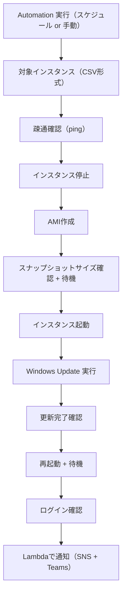

# 🪟 WindowsUpdate 自動化タスク構成資料  
（複数インスタンス + ステップ実行 + 成否通知）

---

## 📌 タスク概要

| 項目     | 内容                                                              |
| -------- | ----------------------------------------------------------------- |
| タスク名 | WindowsUpdate自動化（スケジュール実行）                           |
| 対象     | 複数の Windows Server インスタンス                                |
| 実行内容 | 更新プログラムの適用と再起動、AMI取得、ログイン確認など12ステップ |
| 実行方法 | Systems Manager Automation（スケジュール or 任意実行）            |
| 通知     | 実行完了後に Microsoft Teams とメール（SNS）に成功/失敗を通知     |
| 通知内容 | 各ステップの成功/失敗、対象インスタンスの状態を含む               |

---

## 🎯 ステップ一覧

| ステップ番号 | 処理内容                                                         |
| ------------ | ---------------------------------------------------------------- |
| 1            | ping による疎通確認（SSM経由）                                   |
| 2            | EC2インスタンスの停止                                            |
| 3            | 各インスタンスの AMI 取得                                        |
| 4            | AMI のスナップショットサイズが 1%以上になるまで待機（＋3分待機） |
| 5            | インスタンスの起動                                               |
| 6            | Windows Update の適用（SSM Document）                            |
| 7            | 更新プログラムのインストール完了確認（再起動要求の有無など）     |
| 8            | 3分待機                                                          |
| 9            | インスタンスの再起動                                             |
| 10           | 1分待機                                                          |
| 11           | ログイン確認（WinRM/SSMセッション確認）                          |
| 12           | 成否をまとめて通知（SNS + Teams）                                |

---

## 🧩 構成図（Mermaid）



---

## 🛠️ 実現方法（概要）

- Automation ドキュメントで各ステップを順に定義（aws:runCommand, aws:waitForAwsResourceProperty, aws:createImage など）
- instanceCsv パラメータで対象インスタンスを指定
- Lambda 関数で通知を送信（ステップごとの結果を集計）

---

## 📄 Automation ドキュメント（構成例）

ドキュメントは長いため、以下のような構成で分割して記述します：

1. parseInstanceIds（CSV → List）
2. pingCheck（aws:runCommand）
3. stopInstances（aws:changeInstanceState）
4. createAmi（aws:createImage）
5. waitForSnapshot（aws:waitForAwsResourceProperty + aws:sleep）
6. startInstances（aws:changeInstanceState）
7. runWindowsUpdate（aws:runCommand → AWS-InstallWindowsUpdates）
8. checkUpdateStatus（aws:runCommand）
9. sleep3min（aws:sleep）
10. rebootInstances（aws:changeInstanceState）
11. sleep1min（aws:sleep）
12. loginCheck（aws:runCommand or Session確認）
13. notifyCompletion（aws:invokeLambdaFunction）

各ステップには Outputs を定義し、最終ステップで集約して通知に含めます。

---

## 📬 通知内容（例）

```
✅ WindowsUpdate 自動化タスク完了
📅 実行日時: 2025-08-15 03:00 JST
🖥️ 対象インスタンス:
- i-0123abcd: Success
- i-0456efgh: Failed (Step 6: Windows Update)
📊 ステップ結果:
- Step 1 (Ping): Success
- Step 2 (Stop): Success
- Step 3 (AMI): Success
- Step 4 (Snapshot): Success
- Step 5 (Start): Success
- Step 6 (Update): ❌ Failed on i-0456efgh
- Step 7 (Check): Skipped
- Step 8 (Wait): Skipped
- Step 9 (Reboot): Skipped
- Step 10 (Wait): Skipped
- Step 11 (Login): Skipped
```

---

## ✅ まとめ

| 機能                           | 対応内容                                        |
| ------------------------------ | ----------------------------------------------- |
| ステップ制御                   | Automation ドキュメントで12ステップを順次実行   |
| 複数インスタンス対応           | CSV形式で指定し、全インスタンスに同時適用       |
| Windows Update                 | AWS-InstallWindowsUpdates ドキュメントを使用    |
| AMI取得 + スナップショット確認 | createImage + waitForAwsResourceProperty で実現 |
| 通知                           | Lambda関数で SNS（メール） + Teams に送信       |
| 実行形式                       | 任意実行 or cronスケジュールで定期実行可能      |
