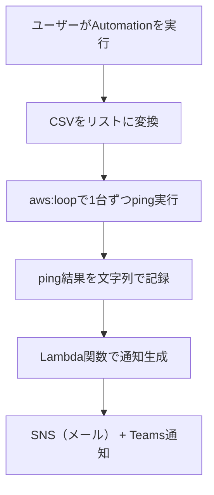

# 📡 Ping 疎通確認 & 成否通知タスク構成資料  
（Systems Manager Automation + Lambda通知）

---

## 📌 タスク概要

| 項目     | 内容                                                     |
| -------- | -------------------------------------------------------- |
| タスク名 | PingCheck                                                |
| 対象     | 複数の Windows Server インスタンス（CSV形式で指定）      |
| 実行内容 | 各インスタンスに順番に ping を実行し、成功/失敗を通知    |
| 実行方法 | Systems Manager Automation（任意実行）                   |
| 通知     | 実行完了後に Microsoft Teams とメール（SNS）に結果を送信 |
| 通知内容 | 各インスタンスの ping 成否を一覧で表示                   |

---

## 🎯 要件整理

### ✅ 機能要件

- ユーザーが入力した CSV 形式のインスタンスIDをリストに変換
- 各インスタンスに対して順番に ping を実行
- ping の成功/失敗を記録し、通知に含める

### ✅ 非機能要件

- 実行はマネジメントコンソール上で完結
- SSH不要（SSM Agent経由）
- 通知はメール（SNS）と Microsoft Teams に送信

---

## 🧩 構成図（Mermaid）



---

## 📄 Automation ドキュメント（YAML）

```yaml
schemaVersion: '0.3'
description: "Ping multiple Windows Server instances sequentially and notify results"
parameters:
  instanceCsv:
    type: String
    description: "Comma-separated list of instance IDs"
  snsTopicArn:
    type: String
    description: "SNS topic ARN for notification"
mainSteps:
  - name: parseInstanceIds
    action: aws:executeScript
    outputs:
      - Name: instanceList
        Selector: $
        Type: StringList
    inputs:
      Runtime: python3.8
      Handler: handler
      Script: |
        def handler(events, context):
            return events['instanceCsv'].split(',')
      InputPayload:
        instanceCsv: "{{ instanceCsv }}"

  - name: pingEachInstance
    action: aws:loop
    outputs:
      - Name: pingResults
        Selector: $.loopOutput
        Type: StringList
    inputs:
      Iterator:
        List: "{{ parseInstanceIds.instanceList }}"
        ElementName: instanceId
      Steps:
        - name: pingCommand
          action: aws:runCommand
          outputs:
            - Name: status
              Selector: $.Status
              Type: String
          inputs:
            DocumentName: AWS-RunPowerShellScript
            InstanceIds:
              - "{{ instanceId }}"
            Parameters:
              commands:
                - |
                  Write-Host "Pinging local machine on instance {{ instanceId }}..."
                  Test-Connection -ComputerName $env:COMPUTERNAME -Count 2 -Quiet
        - name: recordResult
          action: aws:executeScript
          inputs:
            Runtime: python3.8
            Handler: handler
            Script: |
              def handler(events, context):
                  return f"{events['instanceId']}: {events['pingCommand']['status']}"
            InputPayload:
              instanceId: "{{ instanceId }}"
              pingCommand:
                status: "{{ pingCommand.status }}"

  - name: notifyResults
    action: aws:invokeLambdaFunction
    inputs:
      FunctionName: "SendSSMNotificationWithResults"
      Payload:
        taskName: "PingCheck"
        instanceCsv: "{{ instanceCsv }}"
        snsTopicArn: "{{ snsTopicArn }}"
        results: "{{ pingEachInstance.pingResults }}"
```

---

## 🧠 ステップ解説

| ステップ名       | 内容                                                             |
| ---------------- | ---------------------------------------------------------------- |
| parseInstanceIds | CSV文字列を Python でリストに変換                                |
| pingEachInstance | aws:loop で各インスタンスに順番に ping を実行                    |
| pingCommand      | PowerShell で ping を実行し、Status を取得                       |
| recordResult     | instanceId と ping の結果を文字列化（例：`i-0123abcd: Success`） |
| notifyResults    | Lambda 関数を呼び出し、結果を SNS + Teams に通知                 |

---

## 📬 Lambda関数（SendSSMNotificationWithResults）

```python
import json
import boto3
import os
import urllib3

def lambda_handler(event, context):
    sns = boto3.client('sns')
    http = urllib3.PoolManager()

    task_name = event.get('taskName', 'SSM Task')
    instance_csv = event.get('instanceCsv', '')
    results = event.get('results', [])
    topic_arn = event.get('snsTopicArn')
    webhook_url = os.environ.get('TEAMS_WEBHOOK_URL')

    message = f"""
✅ SSM Automation タスク完了: {task_name}
📅 対象インスタンス: {instance_csv}
📊 実行結果:
{chr(10).join(results)}
"""

    if topic_arn:
        sns.publish(TopicArn=topic_arn, Message=message, Subject=f'{task_name} 完了通知')

    if webhook_url:
        http.request('POST', webhook_url,
                     body=json.dumps({"text": message}),
                     headers={'Content-Type': 'application/json'})

    return {"status": "Notification sent"}
```

---

## 📬 通知例（Teams / メール）

```
✅ SSM Automation タスク完了: PingCheck
📅 対象インスタンス: i-0123abcd,i-0456efgh
📊 実行結果:
i-0123abcd: Success
i-0456efgh: Failed
```

---

## ✅ まとめ

| 機能             | 内容                                    |
| ---------------- | --------------------------------------- |
| インスタンス指定 | CSV形式で入力し、Pythonで分解           |
| 疎通確認         | aws:loop で順番に ping を実行           |
| 成否記録         | instanceId とステータスを文字列化       |
| 通知             | Lambda関数で SNS + Teams に送信         |
| 実行形式         | 任意のタイミングで1回実行（Automation） |
