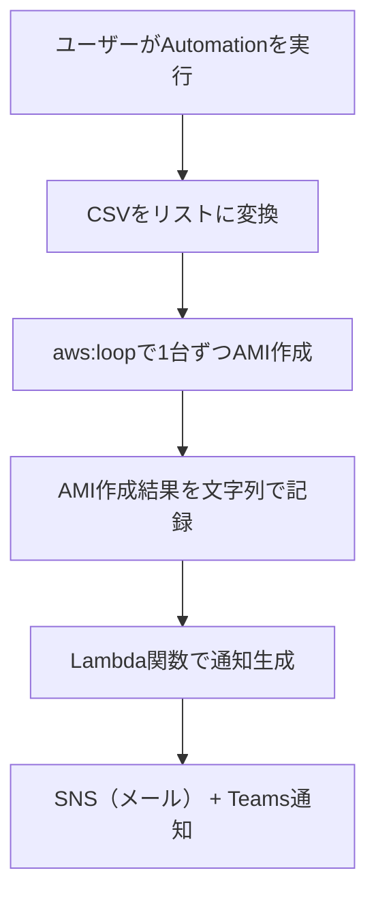

# 📸 AMI 取得 & 成否通知タスク構成資料  
（Systems Manager Automation + Lambda通知）

---

## 📌 タスク概要

| 項目     | 内容                                                     |
| -------- | -------------------------------------------------------- |
| タスク名 | CreateAmiPerInstance                                     |
| 対象     | 複数の Windows Server インスタンス（CSV形式で指定）      |
| 実行内容 | 各インスタンスに対して順番に AMI を作成                  |
| 実行方法 | Systems Manager Automation（任意実行）                   |
| 通知     | 実行完了後に Microsoft Teams とメール（SNS）に結果を送信 |
| 通知内容 | 各インスタンスの AMI 作成の成功/失敗を一覧で表示         |

---

## 🎯 要件整理

### ✅ 機能要件

- ユーザーが入力した CSV 形式のインスタンスIDをリストに変換
- 各インスタンスに対して順番に AMI を作成（NoReboot オプション付き）
- AMI 作成の成功/失敗を記録し、通知に含める

### ✅ 非機能要件

- 実行はマネジメントコンソール上で完結
- IAM ロールに EC2:CreateImage 権限が必要
- 通知はメール（SNS）と Microsoft Teams に送信

---

## 🧩 構成図（Mermaid）



---

## 📄 Automation ドキュメント（YAML）

```yaml
schemaVersion: '0.3'
description: "Create AMI for each instance and notify results"
parameters:
  instanceCsv:
    type: String
    description: "Comma-separated list of instance IDs"
  snsTopicArn:
    type: String
    description: "SNS topic ARN for notification"
mainSteps:
  - name: parseInstanceIds
    action: aws:executeScript
    outputs:
      - Name: instanceList
        Selector: $
        Type: StringList
    inputs:
      Runtime: python3.8
      Handler: handler
      Script: |
        def handler(events, context):
            return events['instanceCsv'].split(',')
      InputPayload:
        instanceCsv: "{{ instanceCsv }}"

  - name: createAmiLoop
    action: aws:loop
    outputs:
      - Name: amiResults
        Selector: $.loopOutput
        Type: StringList
    inputs:
      Iterator:
        List: "{{ parseInstanceIds.instanceList }}"
        ElementName: instanceId
      Steps:
        - name: createAmi
          action: aws:createImage
          outputs:
            - Name: imageId
              Selector: $.ImageId
              Type: String
          inputs:
            InstanceId: "{{ instanceId }}"
            ImageName: "Backup-{{ instanceId }}-{{ global:DATE_TIME }}"
            NoReboot: true

        - name: recordAmiResult
          action: aws:executeScript
          inputs:
            Runtime: python3.8
            Handler: handler
            Script: |
              def handler(events, context):
                  image_id = events.get('createAmi', {}).get('imageId', 'N/A')
                  return f"{events['instanceId']}: AMI {image_id}"
            InputPayload:
              instanceId: "{{ instanceId }}"
              createAmi:
                imageId: "{{ createAmi.imageId }}"

  - name: notifyResults
    action: aws:invokeLambdaFunction
    inputs:
      FunctionName: "SendSSMNotificationWithResults"
      Payload:
        taskName: "CreateAmiPerInstance"
        instanceCsv: "{{ instanceCsv }}"
        snsTopicArn: "{{ snsTopicArn }}"
        results: "{{ createAmiLoop.amiResults }}"
```

---

## 📬 Lambda関数（SendSSMNotificationWithResults）

前回と同じ関数を再利用できます：

```python
import json
import boto3
import os
import urllib3

def lambda_handler(event, context):
    sns = boto3.client('sns')
    http = urllib3.PoolManager()

    task_name = event.get('taskName', 'SSM Task')
    instance_csv = event.get('instanceCsv', '')
    results = event.get('results', [])
    topic_arn = event.get('snsTopicArn')
    webhook_url = os.environ.get('TEAMS_WEBHOOK_URL')

    message = f"""
✅ SSM Automation タスク完了: {task_name}
📅 対象インスタンス: {instance_csv}
📊 実行結果:
{chr(10).join(results)}
"""

    if topic_arn:
        sns.publish(TopicArn=topic_arn, Message=message, Subject=f'{task_name} 完了通知')

    if webhook_url:
        http.request('POST', webhook_url,
                     body=json.dumps({"text": message}),
                     headers={'Content-Type': 'application/json'})

    return {"status": "Notification sent"}
```

---

## 📬 通知例（Teams / メール）

```
✅ SSM Automation タスク完了: CreateAmiPerInstance
📅 対象インスタンス: i-0123abcd,i-0456efgh
📊 実行結果:
i-0123abcd: AMI ami-0a1b2c3d4e5f67890
i-0456efgh: AMI ami-0f9e8d7c6b5a43210
```

---

## ✅ まとめ

| 機能             | 内容                                    |
| ---------------- | --------------------------------------- |
| インスタンス指定 | CSV形式で入力し、Pythonで分解           |
| AMI作成          | aws:createImage を使って順番に作成      |
| 成否記録         | instanceId と AMI ID を文字列化         |
| 通知             | Lambda関数で SNS + Teams に送信         |
| 実行形式         | 任意のタイミングで1回実行（Automation） |