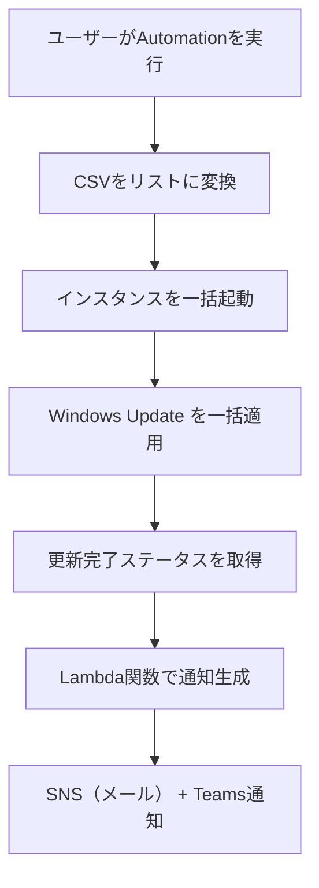

# 🪟 Windows Update 適用 & 成否通知タスク構成資料  
（インスタンス一括起動 → 更新適用 → 完了確認）

---

## 📌 タスク概要

| 項目     | 内容                                                     |
| -------- | -------------------------------------------------------- |
| タスク名 | ApplyWindowsUpdate                                       |
| 対象     | 複数の Windows Server インスタンス（CSV形式で指定）      |
| 実行内容 | 一括起動 → Windows Update 適用 → 更新完了確認            |
| 実行方法 | Systems Manager Automation（任意実行）                   |
| 通知     | 実行完了後に Microsoft Teams とメール（SNS）に結果を送信 |
| 通知内容 | 各インスタンスの更新適用の成功/失敗を一覧で表示          |

---

## 🎯 要件整理

### ✅ 機能要件

- CSV形式で指定された複数インスタンスを一括起動
- AWS-InstallWindowsUpdates ドキュメントで更新プログラムを適用
- 更新完了後、各インスタンスのステータスを確認
- 成否を通知に含める

### ✅ 非機能要件

- 実行はマネジメントコンソール上で完結
- SSH不要（SSM Agent経由）
- 通知はメール（SNS）と Microsoft Teams に送信

---

## 🧩 構成図（Mermaid）



---

## 📄 Automation ドキュメント（YAML）

```yaml
schemaVersion: '0.3'
description: "Start instances, apply Windows Update, and notify results"
parameters:
  instanceCsv:
    type: String
    description: "Comma-separated list of instance IDs"
  snsTopicArn:
    type: String
    description: "SNS topic ARN for notification"
mainSteps:
  - name: parseInstanceIds
    action: aws:executeScript
    outputs:
      - Name: instanceList
        Selector: $
        Type: StringList
    inputs:
      Runtime: python3.8
      Handler: handler
      Script: |
        def handler(events, context):
            return events['instanceCsv'].split(',')
      InputPayload:
        instanceCsv: "{{ instanceCsv }}"

  - name: startInstances
    action: aws:changeInstanceState
    inputs:
      InstanceIds: "{{ parseInstanceIds.instanceList }}"
      DesiredState: running

  - name: applyWindowsUpdate
    action: aws:runCommand
    outputs:
      - Name: commandId
        Selector: $.Command.CommandId
        Type: String
    inputs:
      DocumentName: AWS-InstallWindowsUpdates
      InstanceIds: "{{ parseInstanceIds.instanceList }}"
      Parameters:
        IncludeKbs: []
        ExcludeKbs: []
        CategoryNames: ["SecurityUpdates"]

  - name: summarizeResults
    action: aws:loop
    outputs:
      - Name: updateResults
        Selector: $.loopOutput
        Type: StringList
    inputs:
      Iterator:
        List: "{{ parseInstanceIds.instanceList }}"
        ElementName: instanceId
      Steps:
        - name: getUpdateStatus
          action: aws:executeScript
          inputs:
            Runtime: python3.8
            Handler: handler
            Script: |
              import boto3
              def handler(events, context):
                  ssm = boto3.client('ssm')
                  try:
                      output = ssm.get_command_invocation(
                          CommandId=events['commandId'],
                          InstanceId=events['instanceId']
                      )
                      return f"{events['instanceId']}: {output['Status']}"
                  except Exception as e:
                      return f"{events['instanceId']}: ERROR - {str(e)}"
            InputPayload:
              instanceId: "{{ instanceId }}"
              commandId: "{{ applyWindowsUpdate.commandId }}"

  - name: notifyResults
    action: aws:invokeLambdaFunction
    inputs:
      FunctionName: "SendSSMNotificationWithResults"
      Payload:
        taskName: "ApplyWindowsUpdate"
        instanceCsv: "{{ instanceCsv }}"
        snsTopicArn: "{{ snsTopicArn }}"
        results: "{{ summarizeResults.updateResults }}"
```

---

## 📬 Lambda関数（SendSSMNotificationWithResults）

これまでと同じ関数を再利用できます（内容は省略）。

---

## 📬 通知例（Teams / メール）

```
✅ SSM Automation タスク完了: ApplyWindowsUpdate
📅 対象インスタンス: i-0123abcd,i-0456efgh
📊 実行結果:
i-0123abcd: Success
i-0456efgh: Failed
```

---

## ✅ まとめ

| 機能                | 内容                                                |
| ------------------- | --------------------------------------------------- |
| インスタンス指定    | CSV形式で入力し、Pythonで分解                       |
| 一括起動            | aws:changeInstanceState で全台を一括起動            |
| Windows Update 適用 | AWS-InstallWindowsUpdates ドキュメントを使用        |
| 成否記録            | get_command_invocation で各インスタンスの結果を取得 |
| 通知                | Lambda関数で SNS + Teams に送信                     |
| 実行形式            | 任意のタイミングで1回実行（Automation）             |
