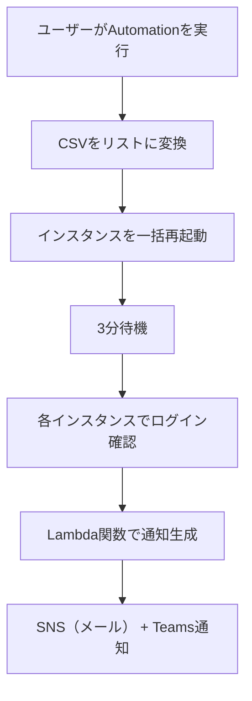

# 🔁 再起動・待機・ログイン確認 & 成否通知タスク構成資料  
（Systems Manager Automation + Lambda通知）

---

## 📌 タスク概要

| 項目     | 内容                                                     |
| -------- | -------------------------------------------------------- |
| タスク名 | RebootAndLoginCheck                                      |
| 対象     | 複数の Windows Server インスタンス（CSV形式で指定）      |
| 実行内容 | 一括再起動 → 3分待機 → ログイン確認（whoami）            |
| 実行方法 | Systems Manager Automation（任意実行）                   |
| 通知     | 実行完了後に Microsoft Teams とメール（SNS）に結果を送信 |
| 通知内容 | 各インスタンスのログイン確認の成功/失敗を一覧で表示      |

---

## 🎯 要件整理

### ✅ 機能要件

- CSV形式で指定された複数インスタンスを一括再起動
- 3分間の待機（安定化のため）
- 各インスタンスに対してログイン確認（whoami 実行）
- 成否を通知に含める

### ✅ 非機能要件

- 実行はマネジメントコンソール上で完結
- SSH不要（SSM Agent経由）
- 通知はメール（SNS）と Microsoft Teams に送信

---

## 🧩 構成図（Mermaid）



---

## 📄 Automation ドキュメント（YAML）

```yaml
schemaVersion: '0.3'
description: "Reboot instances, wait, and verify login"
parameters:
  instanceCsv:
    type: String
    description: "Comma-separated list of instance IDs"
  snsTopicArn:
    type: String
    description: "SNS topic ARN for notification"
mainSteps:
  - name: parseInstanceIds
    action: aws:executeScript
    outputs:
      - Name: instanceList
        Selector: $
        Type: StringList
    inputs:
      Runtime: python3.8
      Handler: handler
      Script: |
        def handler(events, context):
            return events['instanceCsv'].split(',')
      InputPayload:
        instanceCsv: "{{ instanceCsv }}"

  - name: rebootInstances
    action: aws:changeInstanceState
    inputs:
      InstanceIds: "{{ parseInstanceIds.instanceList }}"
      DesiredState: reboot

  - name: waitForStabilization
    action: aws:sleep
    inputs:
      Duration: PT3M

  - name: loginCheckLoop
    action: aws:loop
    outputs:
      - Name: loginResults
        Selector: $.loopOutput
        Type: StringList
    inputs:
      Iterator:
        List: "{{ parseInstanceIds.instanceList }}"
        ElementName: instanceId
      Steps:
        - name: loginCheck
          action: aws:runCommand
          outputs:
            - Name: status
              Selector: $.Status
              Type: String
          inputs:
            DocumentName: AWS-RunPowerShellScript
            InstanceIds:
              - "{{ instanceId }}"
            Parameters:
              commands:
                - whoami
        - name: recordLoginResult
          action: aws:executeScript
          inputs:
            Runtime: python3.8
            Handler: handler
            Script: |
              def handler(events, context):
                  return f"{events['instanceId']}: {events['loginCheck']['status']}"
            InputPayload:
              instanceId: "{{ instanceId }}"
              loginCheck:
                status: "{{ loginCheck.status }}"

  - name: notifyResults
    action: aws:invokeLambdaFunction
    inputs:
      FunctionName: "SendSSMNotificationWithResults"
      Payload:
        taskName: "RebootAndLoginCheck"
        instanceCsv: "{{ instanceCsv }}"
        snsTopicArn: "{{ snsTopicArn }}"
        results: "{{ loginCheckLoop.loginResults }}"
```

---

## 📬 Lambda関数（SendSSMNotificationWithResults）

これまでと同様の関数を再利用できます。

---

## 📬 通知例（Teams / メール）

```
✅ SSM Automation タスク完了: RebootAndLoginCheck
📅 対象インスタンス: i-0123abcd,i-0456efgh
📊 実行結果:
i-0123abcd: Success
i-0456efgh: Failed
```

---

## ✅ まとめ

| 機能             | 内容                                           |
| ---------------- | ---------------------------------------------- |
| インスタンス指定 | CSV形式で入力し、Pythonで分解                  |
| 一括再起動       | aws:changeInstanceState で全台を一括 reboot    |
| 3分待機          | aws:sleep で安定化を待つ                       |
| ログイン確認     | whoami を runCommand で実行し、成功/失敗を記録 |
| 通知             | Lambda関数で SNS + Teams に送信                |
| 実行形式         | 任意のタイミングで1回実行（Automation）        |
